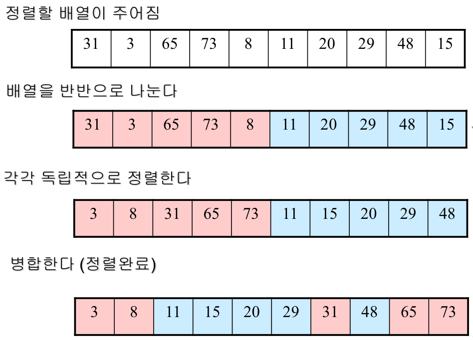

# 5주차

# 고급 정렬 알고리즘

- 병합 정렬 (MergeSort)

- 퀵 정렬 (QuickSort)

- 힙 정렬 (HeapSort)

# 병합 정렬(Merge Sort)

- 전형적인 분합-정복 알고리즘


<br>
<br>

- 분할 과정 `mergeSort()`

```c
void mergeSort(int data[], int left, int right) {

    if (left < right) {
        int middle = (left + right) / 2;
        mergeSort(data, left, middle);
        mergeSort(data, middle + 1, right);
        merge(data, left, middle, right);
    }
}
```

- 합병 과정 `merge()`

```c
void merge(int data[], int left, int middle, int right) {

    int *tmp = (int *) malloc(sizeof(int) * (right - left + 1));

    int i, j, k, l;
    i = left;
    j = middle + 1;
    k = left;

    while (i <= middle && j <= right) {
        if (data[i] <= data[j]) {
            tmp[k++] = data[i++];
        } else {
            tmp[k++] = data[j++];
        }
    }

    if (i > middle) {
        for (l = j; l <= right; l++) {
            tmp[k++] = data[l];
        }
    } else {
        for (l = i; l <= middle; l++) {
            tmp[k++] = data[l];
        }
    }

    for (l = left; l <= right; l++) {
        data[l] = tmp[l];
    }

    free(tmp);
}
```

- `main()`

```c
int main() {

    int n;
    printf("랜덤 수의 개수를 입력하시오. : ");

    scanf("%d", &n);

    int *data = (int *) malloc(sizeof(int) * n);

    srand(time(NULL));

    for (int i = 0; i < n; i++) {
        data[i] = rand() % 100;
    }

    printf("정렬 전 배열 : ");

    for (int i = 0; i < n; i++) {
        printf("%d ", data[i]);
    }

    printf("\n정렬 후 배열 : \n");

    mergeSort(data, 0, n - 1);

    for (int i = 0; i < n; i++) {
        printf("%d ", data[i]);
    }

    free(data);
}
```

- 합병 정렬의 수행 시간 : $T(n)=\Theta(nlogn)$

- 단점 : **정렬을 위해 추가 메모리가 필요**
<br>
<br>
<br>

# 의문점. 왜 k = left로 배열에 접근하는게 가능한가?

- `merger()` 함수에서 k = left로 접근

- 의문의 이유

: 배열의 크기가 할당된 것이 2라고 한다면, 인덱스번호는 각각 0,1 일 것인데, 넘어서는 값 2,3 등으로 접근해도 오류가 발생하지 않는 이유??

```c
#include <stdio.h>
#include <stdlib.h>
#include <time.h>

int count = 0;

void merge(int data[], int left, int middle, int right) {

    int *tmp = (int *) malloc(sizeof(int) * (right - left + 1));

    int i, j, k, l;
    i = left;
    j = middle + 1;
    **k = left;**

    printf("merge 호출 횟수 : %d\n", ++count);
    printf("할당된 공간의 크기 : %d\n", right - left + 1);

    while (i <= middle && j <= right) {
        printf("비교 대상 값 1번 : %d 2번 : %d\n", data[i], data[j]);
        if (data[i] <= data[j]) {
            printf("1번 출력 / 접근하는 인덱스 번호 : %d\n", k);
            tmp[k++] = data[i++];
            printf("2번 출력 / 접근하는 인덱스 번호의 저장 후 값 : %d\n",tmp[k - 1]);
        } else {
            printf("3번 출력 / 접근하는 인덱스 번호 : %d\n", k);
            tmp[k++] = data[j++];
            printf("4번 출력 / 접근하는 인덱스 번호의 저장 후 값 : %d\n",tmp[k - 1]);
        }
    }

    if (i > middle) {
        for (l = j; l <= right; l++) {
            tmp[k++] = data[l];
        }
    } else {
        for (l = i; l <= middle; l++) {
            tmp[k++] = data[l];
        }
    }

    for (l = left; l <= right; l++) {
        printf("tmp[l]의 값 : %d\n", tmp[l]);
        data[l] = tmp[l];
    }
    printf("\n");
    free(tmp);
}

void mergeSort(int data[], int left, int right) {

    if (left < right) {
        int middle = (left + right) / 2;
        mergeSort(data, left, middle);
        mergeSort(data, middle + 1, right);
        merge(data, left, middle, right);
    }
}
```

- **인덱스 번호로 접근을 하는 과정**에서 **할당된 크기를 넘어서는 인덱스 번호로 접근**을 해도 오류가 발생하지 않는 이유가 무엇일까?

- 내가 생각하기로는 동적할당을 진행하였다 한들, 인덱스 번호가 넘어서 접근을 시도하는것 자체가 문제 되는것 같은데 가능한 이유 ??

**아래는 n=8로 호출 했을때 위 함수로 출력되는 결과**

1. 


<br>
<br>

2. 


<br>
<br>

- **둘 다 접근하는 인덱스번호가, 할당된 공간의 크기를 넘어선다.**

# 퀵 정렬(Quick Sort)

- 퀵 정렬은 피봇(pivot)이라 일컫는 배열의 원소(숫자)를 기준으로 피봇으로 정렬을 진행

- 피봇보다 작은 숫자들은 왼편으로, 피봇보다 큰 숫자들은 오른편에 위치하도록 분할

- 그 후 피봇을 그 사이에둠

- **이때, 정렬되서 분할되는 것은 아님**

- 피봇 선정도 랜덤하게 할 수 있음 → **맨 오른쪽, 맨 왼쪽, 가운데 등**


<br>
<br>

<br>
<br>
- 정렬 과정 및 피벗 반환 과정 `partition()` → **맨 우측을 기준으로 진행 중!!**

```c
int partition(int data[], int left, int right) {
    int pivot = data[right];
    int i = left - 1;
    int tmp;

    for (int j = left; j <= right - 1; j++) {
        if (data[j] <= pivot) { // 피벗 보다 작으면, swap 진행
            tmp = data[++i];    // tmp에 값 저장
            data[i] = data[j];  // 피벗보다 작은 값을 저장
            data[j] = tmp;      // 원래 j자리에 tmp값 저장 
        }
    }

		// 피벗을 가운데에 놓기 위한 작업
    data[right] = data[i + 1];
    data[i + 1] = pivot;

    return i + 1;
}
```

- 마지막에 후위 연산자로 계산되어 나오면 잘못된 배열에 접근하므로 `int i = left - 1;` 하여 진행

- 맨 우측을 피벗으로 결정했기 때문에 중간 for문에서 `j <= right -1`로 설정하여 피벗은 포함 안되게 진행

- 재귀 호출 과정 `quickSort()`

```c
void quickSort(int data[], int left, int right) {
    if (left < right) {
        int q = partition(data, left, right);
        quickSort(data, left, q - 1);
        quickSort(data, q + 1, right);
    }
}
```

- `main()`

```c
int main() {

    int n;
    printf("랜덤 수의 개수를 입력하시오. : ");

    scanf("%d", &n);

    int *data = (int *) malloc(sizeof(int) * n);

    srand(time(NULL));

    for (int i = 0; i < n; i++) {
        data[i] = rand() % 100;
    }

    printf("정렬 전 배열 : ");

    for (int i = 0; i < n; i++) {
        printf("%d ", data[i]);
    }

    printf("\n정렬 후 배열 : ");

    quickSort(data, 0, n - 1);

    for (int i = 0; i < n; i++) {
        printf("%d ", data[i]);
    }

    free(data);
}
```

- 평균 수행 시간 : $T(n)=\Theta(nlogn)$

- 최악의 수행 시간 : $T(n) = \Theta(n^2)$ → **한쪽으로 쏠리는 경우**

# 힙 정렬 (HeapSort)

- Heap (최소 힙, 최대 힙)

- 완전 이진 트리로서 다음의 성질을 만족
    - 각 노드의 값은 자신의 children의 값보다 크지 않음(작거나 같음) → 최소 힙
    - 각 노드의 값은 자신의 children의 값보다 작지 않음(크거나 같음) → 최대 힙
    - 맨 아래 층을 제외하고는 완전히 채워져 있음
    - 맨 아래 층은 왼쪽부터 꽉 채워져 있음

<br>

- HeapSort

    - 주어진 배열을 힙으로 만든다음, 차례로 하나씩 힙에서 제거함으로써 정렬

<br>


- HeapSort 과정

1. 주어진 배열을 Heap으로 만듬
2. Heap에서 가장 작은 값을 차례로 하나씩 Heap에서 제거함으로써 Heap의 크기를 줄임
3. Heap에 원소가 남아 있으면 goto 1번
4. Heap에 아무 원소가 남지 않으면 Heap 정렬 종료
    
    → 정렬 순서는 Heap에서 제거된 순서

<br>    

- 요구 과정

1. 주어진 배열을 Heap으로 만드는 과정 → `buildHeap()`
2. Heap에서 최소 원소를 제거하고 나서 Heap의 성질을 만족하도록 수선해주는 과정 → `Heapify()`

<br>

### link나 pointer를 이용하지 않고 Array로 indexing 진행

- 크기 n인 배열 A[1, …, n] dldyd
- A[k]의 자식은 A[2k]와 A[2k+1] 임을 이용
- A[k]의 부모는 A[k/2]


<br>
<br>

### 책에서 진행하는 방법은..

- 배열의 마지막 부분을 고정시키고, 줄여가면서 힙 정렬을 다시하는 방식이다.

- 배열 마지막 부분을 루트와 스왑하여 고정시키기 때문에, 오름 차순으로 정렬하기 위해서는,
최대 힙으로 구현되어야 한다.

- ~~근데 왜 수업때는 최소힙으로 구현했을까..?~~

`heapify()` - 최소 힙

```c
void heapify(int data[], int rootNum, int length) {
  int left = rootNum * 2 + 1;
  int right = rootNum * 2 + 2;
  int smaller, tmp;

  if (right <= length) {
      if (data[left] < data[right]) {
          smaller = left;
      } else {
          smaller = right;
      }
  } else if (left <= length) {
      smaller = left;
  } else {
      return;
  }

  if (data[smaller] < data[rootNum]) {
      tmp = data[rootNum];
      data[rootNum] = data[smaller];
      data[smaller] = tmp;
      heapify(data, smaller, length);
    }
}
```

`heapify()` - 최대 힙

```c
void heapify(int data[], int rootNum, int length) {
	int left = rootNum * 2 + 1;
    int right = rootNum * 2 + 2;
    int bigger, tmp;

    if (right <= length) {
        if (data[left] > data[right]) {
            bigger = left;
        } else {
            bigger = right;
        }
    } else if (left <= length) {
        bigger = left;
    } else {
        return;
    }

    if (data[bigger] > data[rootNum]) {
        tmp = data[rootNum];
        data[rootNum] = data[bigger];
        data[bigger] = tmp;
        heapify(data, bigger, length);
    }
}
```

`buildHeap()` - 먼저 힙으로 만드는 과정

```c
void buildHeap(int data[], int length) {
    for (int i = (length - 1) / 2; i >= 0; i--) {
        heapify(data, i, length);
    }
}
```

`heapSort()` - 힙 정렬 과정 

```c
void heapSort(int data[], int length) {

    int tmp;
    buildHeap(data, length);

    for (int i = length; i >= 1; i--) {
        tmp = data[i];
        data[i] = data[0];
        data[0] = tmp;
        heapify(data, 0, i - 1);
    }
}
```

`main()`

```c
int main() {
    int n;
    printf("랜덤 수의 개수를 입력하시오. : ");

    scanf("%d", &n);

    int *data = (int *) malloc(sizeof(int) * n);

    srand(time(NULL));

    for (int i = 0; i < n; i++) {
        data[i] = rand() % 100;
    }

    printf("정렬 전 배열 : ");

    for (int i = 0; i < n; i++) {
        printf("%d ", data[i]);
    }

    printf("\n정렬 후 배열 : ");

    heapSort(data, n - 1);

    for (int i = 0; i < n; i++) {
        printf("%d ", data[i]);
    }

    free(data);
}
```

**- 어려웠던점**

1. 배열 인덱스 0번부터 접근 해야하는데, 1번부터 접근하여 해결하는 과정을 고민하는데 시간이 많이 소요됨
    - 특히 build힙 부분의 조건 부분을 고민하는데 오래 걸림
2. 최대 힙 ~ 최소 힙 구현과 정렬 과정에 복잡합이 있었음

힙 정렬 수행 시간

- 평균 수행 시간 : $T(n)=O(nlogn)$

- 최악의 수행 시간 : $T(n) = O(logn)$ → **레벨만큼 호출는 경우**