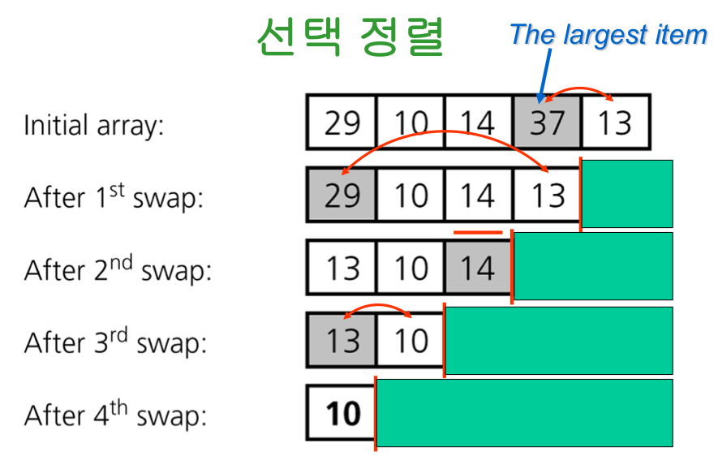

# 4주차
<br>

# 정렬 Sorting
- 대부분 $O(n^2)$ 과 $O(nlogn)$ 사이

- Input이 특수한 성질을 만족하는 경우에는 $O(n)$으로 sorting도 가능
<br>
<br>

# 기초적인 정렬 알고리즘

- 평균적으로 $\Theta(n^2)$ 의 시간이 소요되는 정렬 알고리즘들

→ 입력에 대한 제한이 없음

- 선택 정렬
- 버블 정렬
- 삽입 정렬

<br>

## 선택 정렬

- 원리가 가장 간단한 정렬 기법

- 선택 정렬 개요

1. 각 루프마다
    1. 최대 원소를 찾음
    2. 최대 원소와 맨 오른쪽 원소를 교환
    3. 맨 오른쪽 원소를 제외
2. 하나의 원소만 남을 때까지 위의 루프를 반복


<br>
<br>

`selectionSort.c`

```c
void selectionSort(int data[], int length) { // 데이터 개수를 받은 length
    int j, check, tmp;
    for (int i = length - 1; i >= 0; i--) {
        check = i;
        for (j = i - 1; j >= 0; j--) {
            if (data[j] > data[check]) {
                check = j;
            }
        }
        tmp = data[i]; // 맨 마지막 자리 값 저장
        data[i] = data[check]; // 가장 큰값을 맨 마지막에 넣어줌
        data[check] = tmp; // 가장 큰 값의 자리에 맨 마지막 자리값을 넣어줌
    }
}
```

<br>

## 버블 정렬

- **선택 정렬과 다르게 정렬 진행 간 값을 따로 저장을 안해도 됨**

- 선택 정렬과 같이 제일 큰 원소를 끝자리로 옮기는 작업을 반복

- 다만, 제일 큰 원소를 오른쪽으로 옮기는 방법이 다름


<br>
<br>

`bubbleSort.c`

```c
void bubbleSort(int data[], int length) {
    int tmp;
    int swapCount = -1;
    for (int i = length - 1; i > 0; i--) {

        if (!swapCount) {
            break;
        }
        swapCount = 0;
        for (int j = 0; j < i; j++) {
            if (data[j] > data[j + 1]) {
                tmp = data[j];
                data[j] = data[j + 1];
                data[j + 1] = tmp;
                swapCount++;
            }
        }
    }
}
```

<br>


## 삽입 정렬

- 정렬 방법 개요

1. 각 loop 마다
    - 이미 정렬되어 있는 i-1개 짜리 배열 입력
    - 하나의 원소를 추가 → 배열의 수 = i
    - i개짜리 배열을 정렬 (추가된 원소를 어디에 삽입할 것인지 결정)
2. N개까지 상기 loop를 반복


<br>
<br>

`insertionSort.c`

```c
void insertionSort(int data[], int length) {
    int i, j, key;
    for (i = 1; i < length; i++) {
        key = data[i];
        for (j = i - 1; j >= 0 && data[j] > key; j--) {
            data[j + 1] = data[j];
        }
        data[j + 1] = key;
    }
}
```