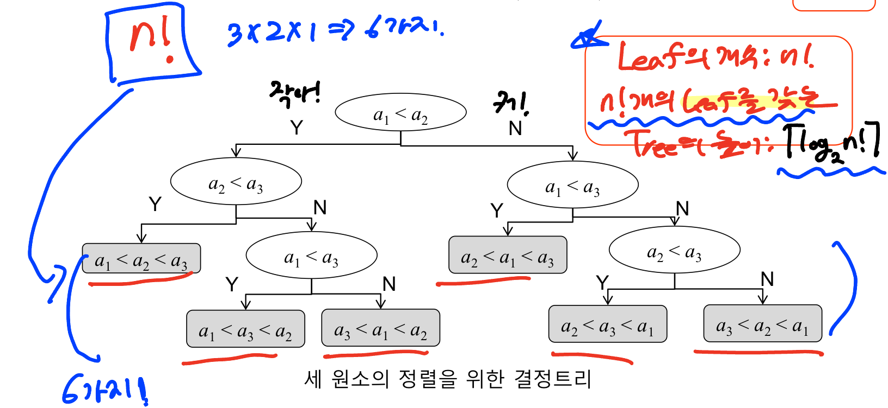

# 6주차

<br>

# 정렬

## 비교정렬 시간의 하한

- 비교정렬 : 원소끼리의 비교를 통해 정렬을 수행

- 비교정렬은 최악의 경우 **수행시간의 하한**? → 최소 이정도는 걸림…
<br>
$$
T(n)=\Omega(nlogn)
$$
<br>
→ 최악의 경우 수행시간이 $\Omega(nlogn)$인 비교정렬 알고리즘은 최적 : **이보다 더 빠를 수 없름**
<br>
<br>

## 비교정렬의 하한 증명

- 크기 n인 원소들의 순서를 고려한 수열(즉, 정렬)의 모든 경우의 수 : n!

- Leaf의 개수 : n!

- n!개의 Leaf를 갖는 Tree의 높이 : $\lceil log_2n! \rceil$ 


<br>

- 최악의 깊이 : $log_2n!$  ← 비교를 기준으로 한 최악의 수행 시간


<br>

### 최악의 경우 수행시간 = $\Theta(nlogn)$

- **병합정렬, 힙 정렬**은 최적의 비교정렬 방법
<br>
<br>

# 특수 정렬 알고리즘

- 최악의 경우 정렬 시간이 $\Theta(nlogn)$보다 더 빠를 수는 없는가?

- 비교 정렬 알고리즘

- 오직 원소의 상대적인 대소 관계 판단에 근거
- 비교정렬 알고리즘은 최악의 경우 수행시간이 $\Theta(nlogn)$보다 빨라 질 수 없음

- 그러나 입력 원소들이 특수한 성질을 만족하는 경우, 더 빠를 수 있음

- $O(n)$ 정렬도 가능
- Counting Sort (계수 정렬)
    - 원소들의 크기가 모두 $O(n)\sim O(n)$ 범위에 있을 때 (수의 범위가 한정적인 경우)
- Radix Sort (기수 정렬)
    - 원소들이 모두 R 이하의 자리수를 가졌을때
    

<br>
<br>

# Counting Sort


<br>


<br>
<br>

$$
Running~time:O(k)+O(n)+O(k)+O(n)=O(n)
$$
<br>

- 만약 k가 $O(nlogn)$을 초과하는 경우? ex) k → $O(n^2)$

: **mergeSort, HeapSort에 비해 장점이 없음**

- Counting Sort의 단점 : 부가 메모리가 필요

- 구현하는 방식을 수정해 부가 메모리 없이도 사용할 수 있음
<br>


`countingSort.c`

```c
void countingSort(int data[], int lastIndexNum) {

    int max = 0;

    for (int i = 0; i < lastIndexNum + 1; i++) { // 가장 큰 수를 찾음
        if (data[i] > max) {
            max = data[i];
        }
    }

    int *temp1 = (int *) malloc(sizeof(int) * (max + 1)); // max +1 까지 해야 0~max 까지 공간 할당
    int *temp2 = (int *) malloc(sizeof(int) * lastIndexNum + 1);

    for (int i = 0; i < max + 1; i++) { // 밑에서 연산자 사용을 위해서 temp1을 0으로 초기화
        temp1[i] = 0;
    }

    for (int i = 0; i <= lastIndexNum; i++) {
        temp2[i] = 0;
    }

    for (int i = 0; i <= lastIndexNum; i++) { //data[]의 배열 값을 인덱스 번호로 가지는 temp1의 count 증가
        temp1[data[i]]++;
    }

    for (int i = 1; i <= max; i++) { // 누적하는 과정 마지막 자리까지 누적 해야하므로 i <= max 설정
        temp1[i] = temp1[i] + temp1[i - 1];
    }

    // 안정성을 파괴한 방법인듯하다.
		/*
    **for (int i = 0; i <= lastIndexNum; i++) {
        temp2[temp1[data[i]] - 1] = data[i];
        temp1[data[i]]--; // 중복되는 값이 없으면 지워도 무방
        printf("look temp1 : ");
        for (int j = 0; j < max + 1; j++) {
            printf("%d ", temp1[j]);
        }
        printf("\n");
    }**
		*/

		for (int i = lastIndexNum; i >= 0; i--) {
				// 주어진 값의 해당하는 등수를 인덱스 번호로 가지는 temp2[]에 저장
        temp2[temp1[data[i]] - 1] = data[i]; 
        temp1[data[i]]--; // 중복되는 값이 없으면 지워도 무방
        printf("look temp1 : ");
        for (int j = 0; j < max + 1; j++) {
            printf("%d ", temp1[j]);
        }
        printf("\nlook temp2 : ");
        for (int j = 0; j < lastIndexNum + 1; j++) {
            printf("%d ", temp2[j]);
        }
        printf("\n");
    }
    for (int i = 0; i <= lastIndexNum; i++) {
        data[i] = temp2[i];
    }

    free(temp1);
    free(temp2);
}
```

- 기존에 증가 연산자를 활용해 작성했던 방식의 countingSort 방법은 안정성을 파괴하는 방법인듯

→ 기존 배열의 순서를 보장하지 않음 <br>
→ 감소 연산자를 활용해 작성진행
<br>
<br>

# Radix Sort

### Stable

- 정렬과정이 기존 원소의 순서를 보장하는가?


<br>


### 조건

- 원소들이 모두 k이하의 자리수를 가졌을 때 ( k : 상수)


<br>


# 효율성 비교


<br>


# 선택 알고리즘

### 배열 A[1 … n]에서 i 번째 작은 원소 찾기


<br>


- 평균적으로 선형시간이 소요되는 알고리즘

- 최악의 경우에도 선형시간이 소요되는 알고리즘

→ 선형 : n의 일차식, $O(n)$

<br>
<br>

# 평균 선형시간 선택알고리즘


<br>


<br>


## 평균 수행 시간


<br>


<br>

<br>

`selectFind.c`

```c
#include <stdio.h>
#include <stdlib.h>
#include <time.h>

// 가장 오른쪽 인덱스 값을 피봇으로 지정
int partition(int data[], int startIndexNum, int endIndexNum) {
    int pivot = data[endIndexNum];
    int tmp;
    int i = startIndexNum - 1;

    // 피벗보다 작으면 왼쪽으로, 피봇보다 크면 오른쪽으로 정렬
    for (int j = startIndexNum; j < endIndexNum; j++) {
        if (data[j] <= pivot) {
            tmp = data[++i];
            data[i] = data[j];
            data[j] = tmp;
        }
    }
    data[endIndexNum] = data[++i];
    data[i] = pivot;
    return i;
}

int selectFind(int data[], int startIndexNum, int endIndexNum, int searchOrderNum) {

    if (startIndexNum == endIndexNum) { // 시작 인덱스 번호와 마지막 인덱스 번호가 같은 상황 = 검색 하려는 값
        return data[startIndexNum];
    }

    int pivotIndexNum = partition(data, startIndexNum, endIndexNum);

    int pivotOrder = pivotIndexNum + 1;

    if (searchOrderNum > pivotOrder) {
        // 피봇 기준 오른쪽 그룹에서 탐색
        return selectFind(data, pivotIndexNum + 1, endIndexNum, searchOrderNum);
    } else if (searchOrderNum == pivotOrder) {
        // 찾으려는 값이 피봇이므로 반환
        return data[pivotIndexNum];
    } else {
        // 피봇 기준 왼쪽 그룹에서 탐색
        return selectFind(data, startIndexNum, pivotIndexNum - 1, searchOrderNum);
    }
}
```