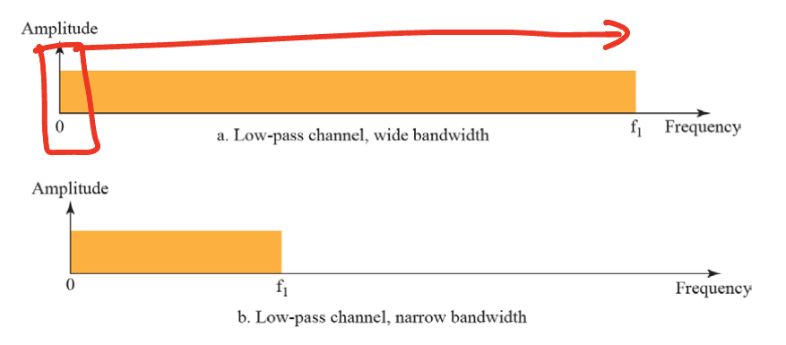

# Chap 5. 아날로그 전송

# 디지털-대-아날로그 변환

- 아날로그 신호의 특성 중 하나 이상을 변경하는 처리
 

## 디지털 신호의 전송

### 기저대역 전송 (Baseband transmission)

- **저대역 채널 사용** → 주파수 0부터 시작하여 사용하는 것

 

### 광대역 전송 (Broadband transmission)

- **띠대역 채널 사용** → 주파수 0부터 시작하지 않아 쉽게 구함

 

**디지털 - 아날로그 변환 : 저대역 채널의 아날로그 신호로 변환** 

: (ASK, FSK, PSK, QAM)

**아날로그 - 아날로그 변환 : 띠대역 채널의 아날로그 신호로 변환**

: (AM/FM Radio)

 
 

## 디지털-대-아날로그 변환의 여러 측명

### 비트율(Bit rate) : 초당 전송되는 비트의 수

### 보오율(Baud rate) : 초당 신호단위의 수

$$
S=N \times {1\over r}\  baud 
$$

S : 신호요소, N : 데이터율(bps), r : 하나의 신호요소에 전달되는 데이터 요소의 수
 
 

### 반송파 신호(Carrier Signal)

   → 아날로그 전송에서 정보 신호의 기반이 되는 고주파 신호

   → 진폭 or 주파수 or 위상을 바꿀지 결정 : **변조**

 
 

### 변조 : 반송파 신호의 특성 중 한 가지 이상을 변화시키는 것

 
 

 
 

## 디지털-대-아날로그 변환 유형

### 진폭 편이 변조 (ASK : Amplitude Shift Keying)

 

- 반송파의 **진폭**이 디지털 데이터에 따라 변화되는 것

- 진폭이 변하지만 주파수와 위상은 변하지 않음

- ASK의 대역폭

    - B(대역폭) = (1 + d(0과 1 사이의 값)) X S(신호율)
    - 따라서, **요구 대역폭은 최소 : S 최대 : 2S**

 

- 2진 ASK의 구현 : 2개의 준위를 사용하여 ASK를 구현

 

- **변조 신호의 대역을 원하는 곳으로 옮길수 있는 것이 장점**

 
 

## 주파수 편이 변조(FSK : Frequency Shift Keying)

 

- 반송파의 주파수가 데이터(0과 1)에 따라 변화

- **2개의 반송파 주파수 사용하여 데이터 요소가 0이면 첫 번째 주파수, 1이면 두 번째 주파수 사용**
 
 

## 위상 편이 변조(PSK : Phase Shift Keying)

- 두개 이상의 서로 다른 신호 요소를 나타내기 위해 신호의 위상이 바뀜

- 이진 ASK만큼 간단하며, **잡음에 강함** → **위상은 신호 싱크만 맞춰주면 되기 때문**

### 구상 PSK (Quadrature PSK) → QAM으로 변경 가능

- 각 신호 요소마다 동시에 2 비트를 사용할 수 있는 방법을 고안

- **두 개의 개별적인 BPSK 변조기 사용**

# 성운 그림

- **진폭과 위상 표현이 가능**
 
 

 
 

## 구상 편이 변조 QAM

- 위상과 진폭을 변화시키는 과정

→ ASK와 PSK의 조합 : **케이블TV 서비스에 사용**

→ 현재 256-QAM은 한 데이터 신호에 8bits(비트)까지 담을 수 있음

 
 

# 아날로그-대-아날로그 변환

## 진폭 변조 (AM : Amplitude modulation)

 

- **신호의 진폭에 따라 반송파의 진폭이 변화**

- 오디오 신호(음성과 음악)의 대역폭은 5kHz

- 라디오 방송국은 최소 10kHz 대역폭 필요 → 방송국 간의 간섭을 피하기 위함
 
 

## 주파수 변조 (FM : Frequency Modulation)

 

- **변조 신호의 전압 준위 변화에 따라 반송 주파수가 변화**

- FM / 스테레오 방송의 오디오 신호 대역폭은 15kHz 필요 → 각 방송국의 200kHz 할당
 
 

## 위상 변조

 

- 정보 신호의 진폭에 따라 반송파의 **위상에 비례하여 변화**