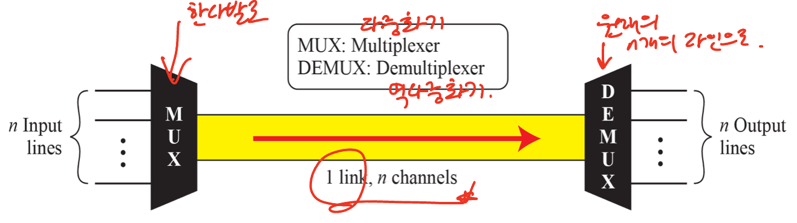

# Chap 6. 대역폭 활용

# 다중화

- 단일 링크를 통하여 여러 개의 신호를 동시에 전송할 수 있도록 해주는 기술

## 다중화 시스템 기본 형식

- 단일 데이터 링크를 통해 여러 개의 신호를 동시에 전송하기 위한 기술

 

- 링크 : 물리적인 경로

- 채널 : 주어진 한 쌍의 장ㅌ치들 사이의 전송을 위한 하나의 경로

## 다중화의 범주

 

# 주파수 분할 다중화

### FDM : frequency-division-multiplexing

- 링크의 대역폭이 전송되는 조합 신호의 대역보다 클 때 적용할 수 있는 **아날로그 기술**

 

### 필요 조건

1. 채널들은 신호가 겹치지 않도록 보호 대역 만큼 서로 떨어져야함
    
    → 보호 대역 : 주파수 분할 다중화를 위한 조건
    
    
 
    
2. 반송 주파수는 원래 데이터의 주파수와 **간섭을 일으키지 않아야함**

## FDM 처리 과정

- 각 신호는 서로 다른 반송 주파수로 변조 후 하나로 만듬

- 이후 개개의 신호를 분리하여 수신기에 전달하게됨

 

 

 
 

# 파장 분할 다중화

### WDM : Wavelength-Division Multiplexing

- 기본 개념은 FDM과 같으며, 광섬유의 고속 전송률을 이용하여 설계

 

WDM은 **광섬유 신호를 조합하기 위한 아날로그 다중화 기법**

- 다중 빛 소스를 단일 빛으로 결합

- 단일 빛은 다중 빛 스스로 분리

- 프리즘 이용 : **임계각과 주파수 기반**

 
 

# 시분할 다중화

### TDM : Time-Division Multiplexing

- 송신과 수신 장치에 의해 요구되는 데이터 전송률 보다 
**전송 매체의 데이터 전송률이 클 때** 적용되는 데이터 처리 기술

 

### **TDM은 여러 개의 저속 채널을 하나의 고속 채널로 조합한 다중화 기술**
 

## 동기식(Synchronous) TDM

- **n개의 연결로 부터 데이터를 전송하는 링크의 전송률**은 데이터 흐름을 보장하기 위해 각 연결의 전송률의 
**최소 n배**가 되어있어야함

 
 

 

 

 

## ! 프레임율은 항상 입력 비트율과 같다 !
 

## 끼워 넣기 (interleaving)

- 스위치가 장치들을 일정한 비율로 정해진 순서대로 이동

 
 

 
 

## 빈 슬럿

- 발신자가 전송할 데이터가 없으면 해당 틈새가 비게됨 → 비효율적

 
 
 

# 데이터 전송률 관리

## 각 입력 회선에서 데이터 전송률이 다를 경우 문제

1. 다중레벨 다중화
2. 복수 슬롯 할당
3. 펄스 채워 넣기
 

## 다중레벨 다중화

- 어느 입력의 데이터율이 다른 것들에 비해 **정수 배만큼 느릴 때 다중화 추가**

 
 

## 복수 슬롯 할당

- 어느 입력의 데이터율이 다른 것들에 비해 **정수 배만큼 빠를 때** 복수 개의 슬롯을 추가(역다중화 이용)

 
 

## 펄스 채워 넣기

- 어느 입력의 데이터율이 다른 것들에 비해 **정수배가 되지 않을 경우** 높은 입력 회선을 기준으로 dummy bit을 채워 넣는 것

 
 

## 프레임 동기화
### 프레임 구성 비트

- 다중화기와 역다중화기 사이에 동기를 맞추기 위해 사용하는 비트(프레임당 1 비트, 0과 1을 반복 사용)

 
 

## 디지털 신호 서비스

- 디지털 신호의 계층 구조 : 전화 회사들은 디지털 신호의 계층 구조를 이용하여 TDM 구현

 
 
한국의 T회선을 사용 / voice channel은 24, 96 …

유럽의 E회선을 사용 / voice channel은 30, 120 …
 
 

# 통계적 시분할 다중화

## 동기 TDM에서는 각 입력 회선이 출력 프레임에 예약된 슬롯을 가지고 있음

- 입력 회선에 데이터가 없을 경우 **효율이 떨어짐**
 
 

## 통계적 TDM

**→ 대역폭 효율을 높이기 위해 슬롯이 동적으로 할당됨**

- 입력 회선에 전송할 데이터가 있을 경우에만 출력 프레임이 슬롯을 할당

- 다중화기는 각 입력 회선을 순서대로 확인하여 회선에 데이터가 있을 경우에만 슬롯을 할당

- 없으면 할당하지 않고 다음 회선으로 이동
 
 

 