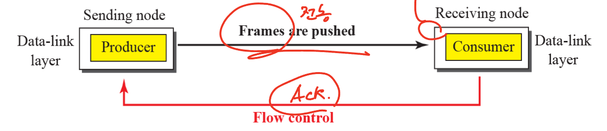

# Chap 11. 데이터 링크 제어
 

# DLC 서비스

## 데이터 링크 제어(DLC) 기능

데이타 링크 제어는 두 인접한 노드 사이의 통신을 위한 절차를 다루며 다음과 같은 기능을 수행

- 프레임 짜기

- 흐름 및 오류 제어

## 프레임 짜기

데이터 링크층은 비트들을 프레임 안에 만들어 넣어 각 프레임이 다른 프레임 구분

- 고정 길이 프레임 : 고정 길이 이므로 프레임 경계가 필요 없음

- 가변 길이 프레임 : 프레임이 끝나는 곳과 다음 프레임이 시작하는 곳을 정의 필요

→ **문자(바이트) 중심 프로토콜 / HDLC**

- 전달되는 데이터는 부호화 시스템의 8비트 문자

- 시작과 마지막에 플레그추가

→ **비트 중심 프로토콜 / PPP**

- 프레임의 데이터 부분을 전부 bit 열로 인식

- 플래그는 “01111110” 비트 패턴 사용

### 문자 중심 프로토콜의 프레임에 flag와 같은 바이트가 존재할 경우? → 바이트 채우기

- 바이트 채우기(byte stuffing)는…

: **문자 중심 프레임 짜기**에서, 텍스트에 플레그나 탈출문자가 있을 때마다 여분의 1문자를 추가하는 처리
 
 

<aside>
❗ 플레그와 같은 형태의 데이터가 플레그로 오인받지 않게 하기 위해 ESC 바이트를 하나 추가하는 것

</aside>

### 비트 중심 프로토콜의 프레임에 flag와 같은 바이트가 존재할 경우? → 비트 채우기

- 0 뒤에 연속하는 다섯 개의 1이 있게 되면 0을 추가로 채워 넣는 과정

- Flag를 제외하고 “01111110”이 존재하지 않게됨

### 흐름 제어

- **확인 응답**을 이용해 전송할 수 있는 데이터의 양을 조정하는 것 : ACK

 

### 오류 제어

- 데이터 링크 계층은 CRC를 통해 수신부에서 오류 여부를 판단 후 폐기

- 손상되지 않으면 흐름과 오류 제어를 위해 **확인 응답**을 송신자에게 전송
 
 

# 데이터 링크층 프로토콜

## 정지 / 대기 프로토콜

- 한 번에 하나의 프레임을 보내고 다음 프레임을 보내기 전에 확인 응답을 기다림

- CRC를 추가해 프레임 손상 여부를 파악 : 수신자의 침묵(확인 응답을 보내지 않는다는 의미)

- 송신자는 재전송 이벤트를 위해 프레임을 보내고 **타이머를 시작**

- 타이머로 재전송 여부 판단

1. 프레임 손실 / 손상
    
    → 타이머를 통해 재전송 여부를 파악해 재전송을 진행
    
2. ACK 손실 시 정지 / 대기 프로토콜의 처리 과정
    
    → 중복된 프레임이 보내지는 현상 발생 가능
    
    → 복구를 위해 Sequence Num과 Ack Num 추가
    
    Ack Num : 다음에 받아야하는 프레임의 순서 번호를 전송
    

## 피지배킹(Piggybacking)

전송되는 데이터에 ACK-Num을 piggybacked하여 보내는 것으로 추가적인 ACK 메시지를 생성할 필요가 없음
 
 

# HDLC(High-level Data Link Control)

하이퍼 레벨 데이터 링크 제어

- 점대점 및 점대다중점 통신 회선을 통한 전송 제어에 사용되는 비트 중심 프로토콜

- 정지/대기 프로토콜로 구현

- 두가지 **전송 모드**를 제공

- 정규 응답 모드 (NRM)
- 비동기 균형 모드(ABM)

### 정규 응답 모드(Normal Response Mode)

- Point to Point / Multipoint → 점-대-점 및 다중점

- 주국은 명령을 보내고, 종국은 응답만 가능

ex) 은행의 단말기

### 비동기 균형 모드 (Asynchronous Balanced Mode)

- Point to Point → 점-대-점

- 두개의 단말이 서로 동등한 위치에서 모두 명령과 응답을 보낼 수 있는 것

## 프레임 : Header의 Controll 필드로 구분

- 정보 프레임 (Information frames) : 데이터 전송 프레임

- 감시 프레임 (Supervisory frames) : ACK와 같은 것을 보내느데 사용데 사용됨

- 무번호 프레임 (Unnumbered frames) : 운영 관리를 위해 사용됨 → NRM or ABM 모드 설정
 
 

# PPP / 점-대-점 프로토콜

- 전용선을 사용하는 점-대-점 연결

- 문자 중심 프레임 사용