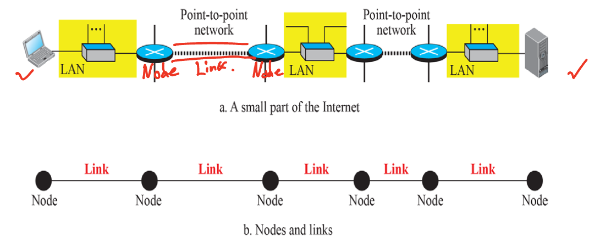

# Chap 9. 데이터 링크층

# 노드와 노드

- 데이터링크 계층의 통신은 노드-대-노드

- 인터넷에 한 지점의 데이터 단위는 다른 지점에 도달하기 위해 LAN과 WLAN과 같은 많은 네트워크를 통해 
전달

→ 데이터 링크 계층은 주로 LAN을 커버

- LAN과 WLAN은 라우터를 통해 연결

 
 

## 서비스

- 데이터링크 계층은 물리 계층과 네트워크 계층 사이에 위치

- 데이터링크 계층은 물리 계층이나 네트워크 계층으로부터 전달받은 서비스를 제공

- 기능

1. 프레임 짜기 : 네트워크 계층으로부터 받은 비트 스트림을 프레임 단위로 나눔
    
    → 패킷을 데이터 영역에 넣고, 앞에는 헤더, 뒤에는 트레일러를 붙여서 프레임을 완성낭만
    
2. **흐름 제어** : 수신자의 수신 데이터 전송률을 고려하여 데이터 전송하도록 제어
    
    → 수신부 노드에 따라 처리 용량 차이 발생 ~ 데이터 전송이 고려되어야함
    
3. **오류 제어** : 손상 또는 손실된 프레임을 발견 / 재전송

- 흐름 제어 ~ 오류 제어는 **Node-Node 사이의 제어**

 

- 이더넷 기반

- 노드가 바뀔때마다 새로운 프레임으로 재구성 → **데이터 링크 계층의 소스 주소와 목적지 주소가 변경됨**
 

## 링크의 두 범주

- 점-대-점 링크에서 링크는 서로 연결된 두 개의 단말에만 전념

- 브로드캐스트 링크의 링크는 몇 개의 기기 쌍 사이에서 공유

 
 

## 두 개의 부계층

- 데이터 링크 제어 (Data Link Control : DLC)

- 점-대-점과 브로드캐스트 링크와 연관된 모든 사항을 다룸

- 매체 접근 제어 (Media Access Control : MAC)

- 브로드캐스트와 관련된 특별한 사항을 다룸
- 동시에 접속하지 못하게 해야함 / **한 사람만 매체에 접근해서 사용하게 해두는 것 → MAC**

 
 
 

# 링크 계층 주소 지정

- 발신지와 목적지 IP주소는 두 종단을 정의하지만, **패킷이 경유하는 경로**에 대해서는 **정의하지 못함**

- 데이터 그램이 네트워크층에서 데이터링크층으로 전달될 때, **데이터 그램은 프레임에 캡슐화**되고 
**두 데이터 링크 주소는 프레임 헤더에 추가됨**

→ 두데이터 링크 ? : **두 노드 사이의 MAC 주소 / 물리 주소**

- 데이터 링크의 주소는 링크 주소, 물리 주소, MAC 주소라고도 불림

 
 

## 세 가지 유형의 주소

- 유니 캐스트 주소
: 일-대-일 통신을 의미하며 유니캐스트 주소 목적지를 갖는 프레임은 링크에서 하나의 장치와 연결

- 멀티 캐스트 주소
: 일-대-다 통신을 의미하며 범위는 로컬 링크로 제한됨 / 수신자가 요청해야됨 / ZOOM 등

- 브로드 캐스트 주소
: 일-대-전체 통신을 의미하며 목적지로 브로드 캐스트 주소를 가지는 프레임은 링크내의 모든 장치로 전달됨

→ 발신자에게 무조건적으로 뿌림
 

 
 

 
 

 
 
 

# 주소 변환 프로토콜(ARP)

### **IP주소로 MAC 주소를 알아내는 프로토콜**

- 링크내 다른 노드로 전송하기 위해, 한 노드가 가지고있는 IP 데이터그램은 수신 노드의 IP 주소를 가지지만, 
**다음 노드의 링크계층 주소를 알아야함**

- 주소 변환 프로토콜 ARP(Address Resolution Protocol) : 주소를 지정된 링크 계층 주소에 매핑시키고, 
데이터 링크 층으로 전달

 
 

 
 

 
 

 
 

 
 

 
 