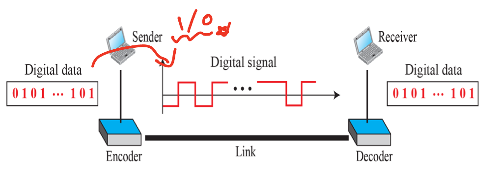

# Chap 4. 디지털 전송

# 디지털-대-디지털 변환

- 3가지 변환 기술

- 회선 부호화
- 블록 부호화
- 뒤섞기

## 회선 부호화

- 디지털 데이터를 디지털 신호로 바꾸는 작업

- 회선 부호화(line coding)와 복호화(Decoding)

 
 

### 신호 요소 대 데이터 요소

- 신호 요소 : 디지털 신호의 가장 짧은 단위 (전달자)

- 데이터 요소 : 데이터를 나타내는 가장 작은 단위체 비트 (bit)

 
 

### **: r은 매 신호 요소당 전송되는 데이터 요소의 개수**

 

## 데이터 전송률 대 신호 전송률
 

### 데이터 전송률 (data rate) / bps

- 1초당 전송된 데이터 요소의 개수 

- 비트율
 
 

### 신호 전송률 (signal rate) / baud(보오)

- 1초당 전송된 신호 요소의 개수

- 변조율, 보오율 이라고 함
 
 

### 데이터 통신의 한가지 목적 : **신호 전송률을 낮추면서 데이터 전송률을 높이는 것**

 
 

### 데이터 전송률(N)과 신호 전송률(S)의 관계

$$
S={N\over r}
$$

$$
S_{ave}=c\times N \times (1/r)\ \  baud
$$

### Example 4.1

---

- 한 개의 신호 요소에 한 개의 데이터 요소를 전달하고 있다면,

- 비트율이 100kps이고, c가 0과 1 사이의 값이라면 보오율은 얼마?

- c의 평균 값이 1/2 이라면…

$$
S=c \times N \times(1/r)=1/2 \  \times 100,000 \  \times\ (1/1)\ = \ 50,000=50\ kbaud  
$$

---
 
 
 

## 나이퀴스트 정리

- 신호 L은 각 준위마다 **$log_2L$** 비트만큼의 신호를 전달할 수 있음

- 각 준위가 한 개의 신호 요소에 해당한다고 하고 (c = 1/2)로 가정하면,

$$
N_{max}=(1/2) \times\ B\ \times\ r\ =\ 2 \  \times B\ \times\ log_{2}L
$$

 
 

# 회선 부호화 오류

- 기준선 표류

    - **복호화 시 수신된 신호 세기의 평균을 측정** : **기준선**
    - 오래 지속되는 0 or 1과 같은 신호는 기준선을 표류 시킬 수 있으며, 복호화 오류를 야기

- 직류 성분

    - 주파수에 잡음이 생김

- 자기 동기화

    - 수신 신호의 복호 시 수신 비트 간격은 발신 비트 간격과 완전하게 일치해야함
    - 자기 동기화 디지털 신호는 데이터 안에 타이밍 정보를 포함 → 자기 동기화 결핍 효과 발생
    
        : 데이터가 밀림  
    
 
 
 
 

# 회선 부호화 방식

1. 단극형 (unipolar)
    
    - 시간 축을 기준으로 전부 위 또는 아래 신호 준위값을 이용
    
2. 극형 (polar)
    
    - 시간 축의 양측 사용
    
    - 0에 대한 전압 준위는 양, 1에 대한 전압 준위는 음을 사용
    
3. 양극형 (biploar)
    
    - 양, 음 및 영의 세가지 전압 준위 사용
    
4. 다준위 (Multilevel)
    
    - L개의 서로 다른 준위를 사용하여 $L^n$개의 신호 요소를 만듬
    
5. 다중 회선 (Multitransition)
    
    - 2개 보다 많은 준위의 신호를 사용하여 **2개 이상의 규칙을 갖음**