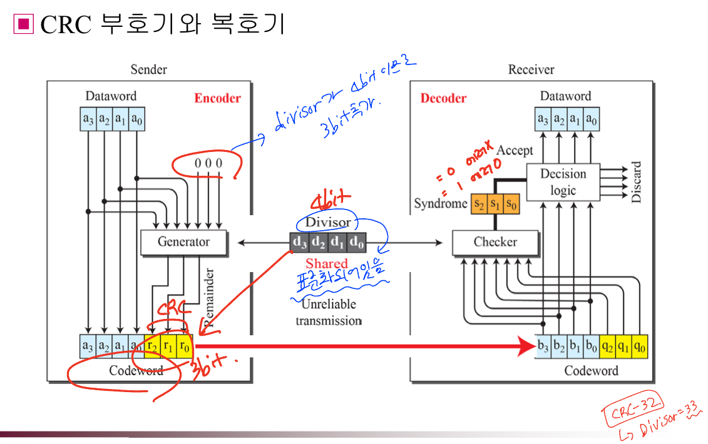

# Chap10. 오류 검출과 오류 정정
 

## 오류의 종류

1. 단일 비트 오류
    
    - 주어진 데이터 단위 중 오직 하나의 비트만이 1에서 0 또는 0에서 1로 변경되는 오류
    
2. 폭주 오류
    
    - 데이터 단위에서 2개 이상의 연속적인 비트들이 1에서 0 또는 0에서 1로 바뀌는 오류
    

## 중복

- 오류를 검출하기 위해 추가로 비트를 보내는 것

- 중복 비트를 통해 수신자는 오류를 찾아내거나 교정할 수 있음

## 검출 vs 교정

오류 검출 : 오류가 생겼는지 알아내는 것 → 몇 개인지 조차 알 필요가 없음

오류 교정 : 정확하게 **몇 비트가 잘못 되었는지, 어디가 잘못 되었는지**를 알아내는 것

## 부호화

중복을 달성하기 위해 부호화(coding)하는 방법 사용

→ **블록 부호화** 방법 사용
 
 

# 블록 부호화

**k 비트의 데이터 워드 블록에 r 개의 중복 비트를 더해 n비트의 코드워드를 만드는 것 :** $n = k+r$

→ **데이터 워드 (dataword)** : 실질적으로 보내는 데이터
 

## 오류 검출

### 해밍 거리

- 오류 제어를 위해 사용되는 것

- 두 개의 같은 크기의 코드 워드 간에 차이가 나는 비트의 개수 : XOR 연산을 해서 얻은 1의 개수

### 최소 해밍 거리

- 모든 가능한 코드 워드 쌍들 사이의 가장 작은 해밍 거리

**- 코드가 s개의 오류를 검출해 내기 위해서는 최소 해밍거리가 s+1이 되어야함**

**해밍 거리 : 4 → 최대 3개까지 오류 검출 가능**
 

## 선형 블록 코드

- **두 유효한 코드워드**에 대해 **XOR 연산을 가해** **다른 유효한 코드 워드를 생성하는 코드**

### 선형 블록 코드의 최소 해밍 거리

- 가장 작은 수의 1을 가지고 있는 코드워드의 1의 개수
 

# 오류 검출 방법

## 패리티 검사 (Parity check)

- 짝수 패리티 (even parity) : 중복 비트를 각 데이터에 붙여 1의 개수가 짝수가 되게함

- 홀수 패리티 (odd parity) : 중복 비트를 각 데이터에 붙여 1의 개수가 홀수가 되게함

→ 각 경우에 대해 **짝수 개의 오류** or **홀수 개의 오류**가 발생하면 에러를 검출하지 못함
 

## 순환 코드 (cyclic code)

- 코드워드를 순환시켜 다른 코드워드를 얻으며 순환 방향은 상관 없음

### 순환 중복 검사 (CRC, cyclic redundancy check)

- **LAN과 WAN에서 널리 사용됨**

- 2진 나눗셈을 기반

- 비트 대신 **CRC 또는 CRC 나머지라 불리는 중복 비트열이 덧붙여짐**

- 데이터 열의 끝에 나머지를 추가하여 얻어진 비트 열은 devisor로 나누어 떨어져야함

 
 

 
 

 
 

### 다항식

- 0과 1의 패턴은 계수 0과 1의 다항식으로 나타낼 수 있음

- 각 항의 지수가 각 비트의 자리수를 나타냄

- 계수는 비트의 값

### 순환 코드 분석

1. 신드롬이 0이 아니면, 한 개 이상의 비트가 손상된 것
2. 신드롬이 0이면, 비트 손상이 없거나 검출에 실패한 것

- 좋은 생성기는 다음 특성을 가져야 함

1. 두 개 이상의 항목으로 되어 있어야함
2. 항목 $x^0$의 계수는 1이어야함
    
    → 모든 단일비트 오류 검출 가능
    
3. $x+1$을 인자로 가져야함
    
    → 모든 홀수개의 오류 검출 가능
    

### 순환 코드의 이점

단일 비트, 두 비트, 홀수 개의 비트 및 폭주 오류를 검출하는데 우수
 
 

## 검사합 (Checksum)

### 장점

: 어떠한 길이의 메시지에도 적용시킬 수 있는 오류 검출 기법

→ 인터넷에서 검사합 기술은 네트워크와 전송 계층에서 사용됨 (헤더 에러 검출)

ex) 숫자를 전송하는 것 외에 **전체 숫자의 합도 전송**

숫자 (7, 11, 12, 0 , 6)의 경우 ~ (7, 11, 12, 0, 6, 36)을 전송 : 36은 원래 숫자들의 합

### 진행 과정

먼저 송신자는 해당 36에 대해 1의 보수 연산을 취한다.

→ 위 예제 36은 2진수로 $(100100)_2$ 인데, 오른쪽 4비트와 나머지 왼쪽 비트를 더해 4비트 숫자로 변환

 

송신자는 해당 값에 대해 1의 보수화를 진행해 검사합 9를 얻고 전송한다.

 

이후 수신자는 전달 받은 값의 1의 보수 연산을 취하게 되며, 이후 1의 보수화를 진행하여 신드롬이 0인지 체크

→ 전달 받은 값의 1의 보수연산 : 15 / $(1111)_2$ , 15의 1의 보수화 = 0 / $(0000)_2$

