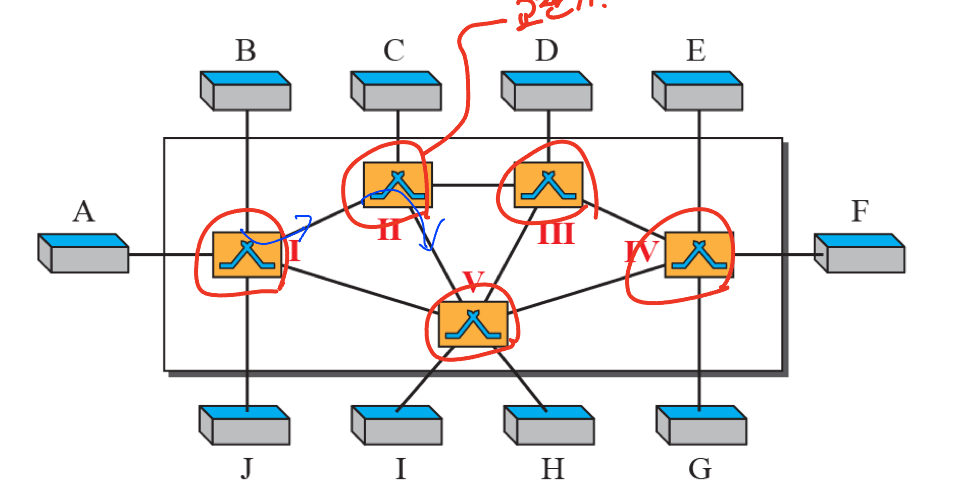

# Chap 8. 스위칭
 

# 개요

## 교환

- 네트워크는 서로 연결되어 있는 장치들의 집합

- 다중 장치가 있을 때, 각각의 장치를 어떻게 1 대 1로 연결할 것인가

- 그 해결 방법이 교환이며 교환망은 **교환기라고 불리는 상호 연결된 장치**들로 구성

 
 

## 3가지 교환 방법

- 회선 교환

- 패킷 교환

- 메시지 교환

 
 

# 회선 교환망

- 회선 교환 망은 물리 링크로 연결된 일련의 교환기로 구성

- 각 링크는 보통 아날로그 or 전자식 방식으로 n개의 채널로 나뉘게 됨

### 회선 교환 (Circuit switch)

- 한번 연결되면 통화가 완료될 때 까지 전송할 데이터의 유무에 관계 없이 **회선을 점유 → 점유 시간**

 
 

### 회선 교환망

- n개의 입력과 m개의 출력을 갖는 장치

## 세 단계

1. 연결 설정 단계
 - 교환기 사이에 전용 회선을 만드는 것
 - 자원 할당
2. 데이터 전송 단계
 - 음성 데이터 전송
3. 연결 해제 단계
 - 사용한 자원 해지

전화 VS 이메일로 생각하면 쉬움
 
 

# 패킷 교환 망

- 메시지가 패킷 교환 망을 통과한다면 메시지는 일정 크기 또는 가변 크기의 패킷으로 나뉘어져야함

## 데이터그램 망

- 통신망에서 데이터를 전송할 때 사전에 회선의 결정이 이루어지지 않음

- 각각의 **패킷별로 주소**를 갖고 목적지를 찾아감

- 회선을 점유하지 않기 때문에 효율적 / **경로를 점유**

 
 

### **패킷 교환망에서 자원 예약은 없으며, 자원은 필요에 따라 할당**
 

## 라우팅 테이블 (Routing table)

- 데이터그램 망의 교환기는 목적지 주소에 기반을 두는 라우팅 테이블을 가지고 있음

- 인터넷에서 교환은 네트워크 층에서 목적지 주소를 보고 패킷을 교환하는 데이터그램 방식

 
 

## 가상회선 망 → 성능과 속도 보장

### 가상회선 망(virtual-circuit network)

- 회선교환 망과 데이터그램 망을 섞은 것과 같이 양쪽의 특성을 모두 가지고 있음

-  주소 ~ 경로 / Path(경로)를 점유함
 

### 가상회선 망의 특성

- 회선 교환 망처럼 연결 설정 및 연결 해제 단계가 존재

- 회선 교환처럼 자원이 **연결 설정 단계에서 할당될 수도 있고, 필요에 따라 할당될 수도 있음**

- 데이터그램 망처럼 데이터는 패킷으로 전송되며, 각 패킷은 **헤더에 주소가 들어있음**

- 회선 교환처럼 연결이 설정되고 나면 **패킷은 같은 경로를 따라 전송됨**

- 가상회선 망은 보통 데이터 링크층에서 구현

### 가상회선 주소 지정

- 가상회선 식별자(VCI, Virtual Circuit Identifier)

→ 교환기에서 사용되는 주소로서 프레임에서 사용

 
 

### 가상회선 망의 교환기와 테이블

- VCI Table은 연결 설정 단계에서 경로를 예약

 
 

# 교환기 구조

- 회선 교환이나 패킷 교환에서는 교환기를 사용

## 시 분할(Time Division) 교환

- TDM(Time-division multiplexing)과 TSI(Time-Slot Interchange)를 이용해 확립

→ TSI : 요구되는 연결을 기반으로 한 슬롯 번호 변경

 
 

## 타임 슬럿 상호 교환 (TSI : Time-Slot Interchange)

 
 
 

# 패킷 교환기 구조

- 패킷 교환망에서 사용되는 교환기(라우터)는 회선 교환망의 교환기와 다른 구조를 갖음

- 패킷 교환기 구성요소 : 입력포트, 출력포트, 라우팅 처리기, 교환 회로

 
 

## 입력 포트

- 패킷 교환의 물리 및 데이터 링크층 기능을 수행

 
 

## 출력 포트

- 순서만 반대일뿐 입력 포트와 같은 기능 수행

 
 

## 반얀 교환기

- 어떤 입력이 들어오든 출력포트의 2진수로 찾아감

 

- **내부 충돌이 발생할 가능성이 있음**
 
 

## 뱃처 반얀 교환기

- 목적지 포트 주소에 기반하여 입력 패킷을 정렬

 
 