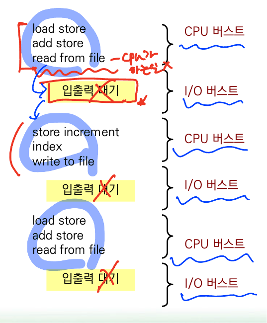

# 5주차 - CPU 스케줄링

# 기본 개념

## CPU-입출력 버스트 사이클

- CPU 스케줄링의 성공은 프로세스들의 다음과 같은 관찰된 성질에 의해 좌우
    - 프로세스의 실행은 CPU 실행과 입출력 대기의 사이클로 구성
    - CPU 버스트로 시작하여, 뒤이어 입출력 버스트가 발생, 
    이어 또 다른 CPU 버스트가 발생, 이어 또다른 입출력 버스트 등으로 진행
    - 마지막 CPU 버스트는 실행을 종료하기 위한 시스템 요청과 함께 끝남
- **CPU 스케줄링은 CPU 버스트 부분에 할당**

 
 

## CPU 스케줄러

- OS는 준비 큐에 있는 프로세스들 중에서 하나를 선택해 실행

- 준비 큐는 반드시 선입 선출 방식의 큐는 아님
  

## 선점 및 비선점 스케줄링

 
 

- CPU 스케줄링이 발생하는 상황들

1. 프로세스가 실행 상태에서 대기 상태로 전환될 때
2. 프로세스가 실행 상태에서 준비 상태로 전환될 떄
3. 프로세스가 대기 상태에서 준비 상태로 전환될 때
4. 프로세스가 종료할 때

- **비선점 스케줄링**

    - 조건 1,4 하에서만 스케줄링이 발생하는 경우 → 협조적 스케줄링

- **선점 스케줄링**

    - 비선점 이외의 모든 스케줄링

 
 

# 스케줄링 알고리즘

## 스케줄링 기준
 

### 비교 기준

- CPU 이용률
 

- 처리량
 
: 단위 시간당 완료된 프로세스의 개수
 

- 응답 시간
 

- 총 처리 시간

: 프로세스의 제출 시간과 완료 시간의 간격
 

= 준비 큐에서 대기한 시간 + CPU에서 실행한 시간 ~~**+ 입출력 시간**~~

 
- 대기 시간(waiting time)

: **준비 큐에서 대기하는 시간**

→ CPU 스케줄링 알고리즘은 프로세스 실행 시간과 입출력 시간에는 영향을 미치지 않음

<aside>
❗ 총처리 시간, 대기 시간, 응답 시간은 줄이고, CPU 이용률과 처리량은 늘리는 것이 바람직

</aside>
 
 

## 선점 VS 비선점 스케줄링

### 선점 : 프로세스가 현재 실행되고 있는 프로세스의 남은 시간보다 짧은 버스트를 가지면, 
현재 실행중인 프로세스를 선점

### 비선점 : 실행중인 프로세스가 CPU 버스트를 완료할 때까지 선점하지 않음

 

## 선입 선처리(FCFS) 스케줄링

- 가장 간단한 CPU 스케줄링 알고리즘

- **CPU를 먼저 요청하는 프로세스가 CPU를 먼저 할당 받음**

- 선입 선출(FIFO)로 구현

- 평균 대기 시간이 긴 경우가 있음

 
 

- **평균 대기 시간 구하는 방법 확인!**

- **평균 총 처리 시간 구하는 방법 확인!**

### 문제점 : **CPU 버스트가 짧은 프로세스가 긴 프로세스 뒤에 나열됨**

- 특히, **선입 선처리 알고리즘은 대화형 시스템에서 문제됨**

 
 

## 최단 작업 우선(SJF) 스케줄링

- **CPU 버스트가 가장 짧은 프로세스에게 할당**

- **평균 대기시간을 최적화 시킴**

 
 

- 해당 예시는 **도착시간이 고려되지 않음**

- 최단 작업 우선 스케줄링은 **선점권이 있거나 없을 수 있음**

- 비선점형 스케줄링

 
 

<aside>
❗ 대기시간 : 큐에서 기다린 시간 / 시작 - 도착 = 대기

</aside>

<aside>
❗ 총 처리 시간 : 최종 끝난 시간 - 들어온 시간

</aside>

- 선점형 스케줄링

 
 

### SJF의 가장 치명적인 단점 : 다음 CPU 버스트의 길이를 알 방법이 없음

-  OS는 버스트 길이를 모름

-  최단 작업 우선 스케줄링에 근사하도록 시도

→ **다음 CPU 버스트가 앞의 버스트와 길이가 유사하다고 간주하고 진행**

-  연구용으로만 사용됨 ~ 일반적인 스케줄링에서는 쓰지 않음

-  **실시간 스케줄링**에 사용 (임베디드 시스템)

 
 

## 라운드-로빈(Round-robin) 스케줄링 / 시분할 TimeSharing

- **시분할 시스템을 위해 특별히 설계**

- 무조건 **선점형**

- **스케줄러는 준비 큐를 돌아가면서 한번에 한 프로세스에 한 번의 시간 할당량 만큼 CPU를 할당**

 
 

### 단점 :  **문맥 교환**

- 라운드 로빈 스케줄링의 성능은 시간 할당량의 크기에 매우 많은 영향을 받음

ex) 1번 실행을 위해 세팅되어 있는 상태에서 2번 실행 상태로 세팅 하기위해 시간이 걸림

- 시간 할당량이 매우 크면, 선입 선처리 정책과 같음

- 시간 할당량이 매우 작으면 **매우 많은 문맥 교환**을 야기

 
 

## 우선 순위(Priority) 스케줄링

- 우선 순위가 각 프로세스에게 주어지고 **CPU는 가장 높은 우선순위를 가진 프로세스에 할당 됨**

 
 

- 선점이나 비선점일 수 있음

- 선점형 우선 순위 스케줄링 알고리즘
    - 새로 도착한 프로세스의 우선 순위가 현재 실행되는 프로세스의 우선 순위보다 높으면 CPU를 선점
- 비선점형 우선 순위 스케줄링 알고리즘
    - 단순히 준비 큐의 머리 부분에 새로운 프로세스를 넣음
 
 

### 무한 봉쇄 또는 기아 상태

- 부하가 과중한 컴퓨터 시스템에서는 높은 우선 순위의 프로세스들이 꾸준히 들어와서 낮은 우선 순위의 프로세스들이 CPU를 사용하지 못하게 될 수도 있음

: SJF도 발생할 수 도 있음 (하지만 실제로 SJF는 사용하지 않음)

→ 에이징(aging)으로 해결

: **오래 대기하는 프로세스들의 우선 순위를 점진적으로 증가시킴**

 
 