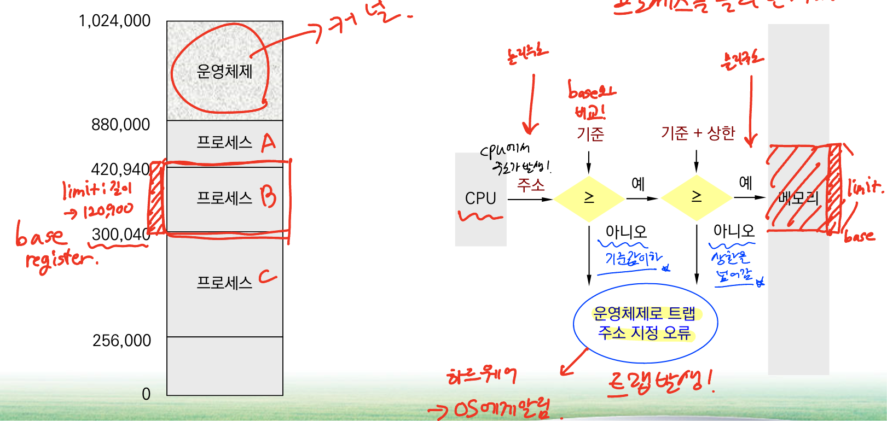

# 9주차. 메인 메모리

### 메모리는 각각 주소가 할당된 일련의 바이트로 구성

→ 주소를 기반으로 동작

## 기본 하드웨어

- 메인 메모리와 각 처리 코어에 내장된 레지스터들은 CPU가 직접 접근할 수 있는 유일한 범용 장치

→ 메모리 주소만을 인수로 취함

### 각각의 프로세스가 독립된 메모리 공간을 가지도록 보장해야 함

- 기준(base)과 상한(limit) 레지스터를 보호 기법을 제공

OS에게 주소 지정오류가 발생했다는 것을 알림 ( 트랩 )
 
 

## 주소의 할당

: 메인 메모리로 올라와서 “프로세스가 되어야 함”

 
 

### 컴파일 시간 바인딩

- 컴파일 시, 해당되는 메모리의 위치를 결정

 
 

### 적재시간 바인딩

- 메모리에 올릴 때 주소 결정

 
 

### 실행시간 바인딩

- 실행 중간에 메모리의 주소가 바뀔 수 있음

 
 

## 논리 대 물리 주소 공간

- 논리 주소 : CPU가 생성하는 주소 = 가상 주소 (virtual address)

- 물리 주소 : 메모리에 나타나는 주소

**메모리 관리기(Memory Management Unit; MMU)** : 가상 주소에서 물리 주소로의 사상을 수행하는 하드웨어 장치

 
 

단순 MMU 기법 : 재비치(relocation) 레지스터(기준 레지스터)의 사용 = 실행시간 바인딩 케이스

 
 

## 동적 적재

프로세스 전체가 미리 메모리에 올라와 있어야 하는데, **프로세스의 크기는 메모리의 크기보다 커서는 안됨**

→ 메모리 공간의 더 효율적인 이용을 위해 동적 적재(dynamic loading)를 해야 함

: **오류 처리 루틴**과 같이 아주 간혹 발생하면서도 많은 양의 코드를 필요로 하는 경우에 특히 유용
 

## 동적 연결 및 공유 라이브러리

동적 연결 라이브러리 : `*.dll`

- 사용자 프로그램이 실행될 때, 사용자 프로그램에 연결되는 시스템 라이브러리

- **스텁(stub)**이라는 작은 코드 조각을 통해 라이브러리의 포함을 알림 (연결고리 역할)

- 동적으로 연결되었기 때문에 크기가 크지 않음

- 라이브러리의 업데이트 후에도 동적으로 연결되어 교체 간에 큰 어려움이 없음

 
 

# 연속 메모리 할당

### 예시를 통해 확인

 
 

 
 

 
 

 
 

- 동적 메모리 할당 문제

1. 최초 적합(first-fit)
    
    - 첫 번째 사용 가능한 가용 공간에 할당
    
2. 최적 적합(best-fit)
    
    - 사용 가능한 공간 중에서 가장 작은 가용 공간을 할당
    
3. 최악 적합(worst-fit)
    
    - 가장 큰 가용 공간을 할당 → 최적 적합 시 남은 공간이 버려질 수 있으니 이게 더 좋지 않을까?라는 접근이였으나, 성능이 좋지 않음
    

**최초 적합 또는 최적 적합이 최악 적합보다 좋다고 입증됨**

 

## 단편화

### 외부 단편화 (external fragmentation)

- 프로세스들이 메모리에 적재되고 제거될 때, 작은 조각들이 남아있다는 의미 / 할당되지 않은 것

### 해결 방법

1. **내부 단편화** : 아주 작은 가용 공간은 큰 요구에 포함시켜 할당하는 것 
    
    
    
    
    **할당했으나, 실제 사용하지 않는 내부적인 조각 : 내부 단편**
    

1. **밀집** : 한쪽으로 밀어서 공간을 만듬 

- 메모리의 내용들을 적절하게 움직여서 모든 자유 공간을 하나의 큰 블록으로 만듬

- 재배치가 동적이고, 수행시간에 이루어지는 경우에만 가능 → 시간 낭비가 심할 수 있음