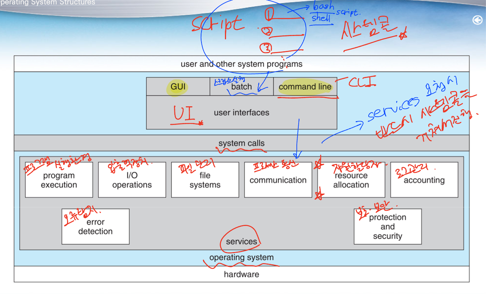

# 2주차 - 운영체제 구조

 

# 운영체제 서비스

 
 

## 프로그래머의 편리성 제공

### 운영체제는 프로그램 실행 환경을 제공

- **프로그램과 사용자들에게 특정 서비스를 제공**
- **프로그래밍을 쉽게 할 수 있는 편리함을 제공**

- **사용자 인터페이스** (user interface, UI)

- 거의 모든 운영체제가 UI를 가지고 있으며 여러 형태를 가질 수 있음
    
    - 명령어 라인 인터페이스 (Command-line interface, CLI)
    
    - 그래피컬 사용자 인터페이스 (Graphics user interface, GUI)
    
    - 배치 인터페이스 (Batch interface)
    

- **프로그램 수행** (program execution)

- **프로그램을 메모리에 적재하여 실행할 수 있음**
- 프로그램이 정상적이든 혹은 비정상적이든 실행을 끝낼 수 있음

- **입출력 연산** (I/O operation)

- 실행중인 프로그램에 의해 요구되는 입출력 동작을 위한 방법을 제공
- 파일, 입출력 장치가 연관될 수 있음

- **파일 시스템 조작** (file system manipulation)

- 프로그램이 파일을 읽고 쓸 수 있음
- 이름에 의해 파일을 생성/삭제할 수 있고, 지정된 파일을 찾을 수 있고, 파일의 정보를 열거할 수 있음

- **통신** (communication)

- 한 프로세스가 다른 프로세스와 정보를 교환하는 방법을 제공
    - 동일한 컴퓨터에서 실행되고 있는 프로세스 사이
    - 컴퓨터 네트워크에 연결된 다른 컴퓨터 시스템 상에서 실행되는 프로세스들 사이

- **오류 탐지** (error detection)

- 모든 가능한 오류를 항상 탐지해야 함
    
    - 오류는 CPU, 메모리, 입출력 장치, 사용자 프로그램에 의해 발생 가능
    
- 올바르고 일관성 있는 계산을 보장하기 위해 각 유형의 오류에 대해 적절히 조치 필요
 
 

## 시스템 자체의 효율적인 동작 보장

### **시스템 자체의 효율적인 동작을 보장하기 위한 기능들을 제공**

- 자원 할당 (resource allocation)
    - 다수의 프로세스나 작업들이 동시에 실행될 때 각각에 자원들을 할당
    - 어떤 자원들은 특수한 할당 코드를 가질 수 있고, 또 다른 자원은 일반적인 요청/해제 코드를 가질 수 있음
- 기록 작성(logging) / (accounting)
    - 어떤 프로그램이 어떤 종류의 컴퓨터 자원을 얼마나 많이 사용하는지 추적할 수 있기를 원함
    - 기록 관리는 회계, 또는 사용자 통계를 내기 위해 사용
    - 사용 통계는 컴퓨팅 서비스를 개선하기 위해 시스템을 재구성하고자 하는 시스템 관리자에게 귀중한 자료
- 보호(protection)와 보안(security)
    - 다중 사용자 컴퓨터 시스템 or 네트워크로 연결된 컴퓨터 시스템에 저장된 정보의 소유자
        
        → 정보의 사용을 통제하길 원함
        
    - 보호 : 시스템 자원에 대한 모든 접근이 통제되도록 보장하는 것을 필요로 함
    - 보안 : 네트워크 어댑터 등과 같은 외부 입출력 장치들을 부적합한 접근 시도로부터 지킴
        
        침입의 탐지를 위해 모든 접속을 기록
 
 

# 사용자와 운영체제 인터페이스

## 명령어 인터프리터 (CLI)

- Linux, Unix, Windows를 포함한 OS 대부분은 명령어 인터프리터를 특수한 프로그램으로 취급
- 시스템에서 선택할 수 있는 여러 명령 인터프리터(CLI)를 제공 → 쉘=셸(shell)
- 명령어 인터프리터의 주요 기능
    - 사용자가 지정한 명령을 가져와서 그것을 수행하는 것
    - 제공된 많은 명령들이 파일을 조작(생성, 삭제, 리스트, 프린트, 실행, 복사)
- 명령어 구현의 두 가지 일반적인 방식
    - (일부) 명령어 인터프리터 자체가 명령을 실행할 코드를 갖고 있는 경우
        - 제공될 수 있는 명령의 수가 명령 인터프리터의 크기를 결정
    - **시스템 프로그램(OS)**에 의해 대부분의 명령을 구현하는 경우
        - 명령어 인터프리터는 명령을 전혀 알지 못하고, 실행될 파일을 식별하여 명령을 실행

## 그래픽 기반 사용자 인터페이스 (GUI)

- 사용자 친화적인 그래픽 기반 사용자 인터페이스(GUI)를 통한 방식
    - 아이콘(icon)이 프로그램, 파일, 시스템 기능 등을 나타냄
    - 마우스 포인터의 위치에 따라서 명령을 실행 할 수 있음
- 많은 시스템들이 CLI와 GUI 인터페이스를 모두 제공
    - Microsoft Winodws
        - GUI with CLI “command” shell / ← 명령 프롬프트
    - Apple Mac OS X
        - “Aqua” GUI interface with UNIX kernel underneath and shells available
    - Unix and Linux
        - CLI with optional GUI interfaces(CDE, KDE, GNOME)

 

# 시스템 콜

## 시스템 콜의 사용

### 운영체제에 의해 사용 가능한 서비스에 대한 인터페이스를 제공

- 특정 저 수준 작업은 어셈블리 명령을 사용하여 작성되어야 하지만
시스템 콜은 일반적으로 C, C++ 언어로 작성된 함수 형태로 제공

 
 

## 응용 프로그래밍 인터페이스

### 응용 프로그래머가 사용 가능한 가장 대중적인 세가지 API

- Windows API for Windows
- POSIX API : 거의 모든 버전의 UNIX, Linux 및 Mac OS X를 포함
- Java API for the Java Virtual Machine (JVM)

### 표준 API 예 : 파일로부터 자료를 읽어 들이는 함수

- 응용 프로그래머가 시스템 콜을 부르는 것보다 API로 프로그래밍 하는것을 선호하는이유 ?

: 프로그램의 호환성

→ 시스템 콜은 프로그램 상에서 작업하기가 응용 프로그래머에게 가용한 API 보다 더 어려움

→ 시스템 콜 인터페이스

- API 함수의 호출을 가로채어 운영체제 시스템 콜을 부르며, 시스템 콜의 결과 값과 상태를 반환
- 일반적으로 각 시스템 콜마다 하나의 번호가 연관
    - 시스템 콜 인터페이스는 이들 번호에 따라 색인되는 테이블을 유지

 
 
 

# 시스템 콜의 유형

## 프로세스 제어

- 프로그램의 끝내기(end) 또는 중지(abort)

- 실행중인 프로그램은 수행을 정상적으로 또는 비정상으로 멈출 수 있어야 함

- 프로그램의 적재(load)와 실행(execute)

- 한 프로그램을 실행하고 있는 프로세스나 작업이 다른 프로그램을 적재하고 실행하기를 원할 수 있음
- 명령어 인터프리터가 사용자 명령 또는 마우스의 클릭을 통하여 지시된 프로그램을 실행하는 것을 허용

- 프로세스의 생성(create)과 종료(terminate)

- 새로운 작업이나 프로세스를 생성하고 프로세스가 잘못되었거나 더 이상 필요 없을 때 종료

- 프로세스 속성(process attribute)의 획득과 설정

- 작업의 우선순위, 최대 허용 실행 시간 등을 포함하여 작업 혹은 프로세스의 속성들을 제어

- 새로운 작업이나 프로세스 생성 후 이들의 실행이 끝나기를 기다릴 필요가 있음

- 시간 기다림 (wait time)
- 사건 기다림 (wait event) 및 알림 (signal event)

- 공유되는 데이터의 일관성 보장을 위해 공유 데이터를 잠글 수 있는 시스템 콜을 제공

- 데이터가 잠겨 있는 동안에는 다른 프로세스의 접근을 막을 수 있게 함

 

## 파일 관리

- 파일 관리를 위한 시스템 콜

- 파일 생성과 삭제
- 파일 열기와 닫기
- 읽기, 쓰기, 위치 변경
- 파일 속성의 획득과 설정
    - 파일 이름, 형태, 보호 코드, 사용료 계산 정보 등

- 파일 시스템이 디렉터리 구조를 가졌다면, 디렉터리에 대해서도 파일에서와 같은 동작이 필요

## 장치 관리

- 프로세스는 작업을 계속 수행하기 위해 추가 자원을 필요로 할 수 있음

- 주 기억장치, 디스크 드라이브, 파일에의 접근 등
- 운영체제에 의해 제어되는 다양한 자원들은 장치로 간주될 수 있음

- 장치 관리를 위한 시스템 콜들

- 장치의 요청(request)과 방출(release)
    - 다수의 사용자가 있는 경우 장치 사용 독점을 위해
    - 파일의 열기와 닫기 시스템 콜에 대응
- 읽기, 쓰기, 위치 변경(reposition)

## 정보 유지 관리

- 사용자 프로그램과 운영체제 간의 정보 전달을 위해 존재하는 시스템 콜들

- 현재 시간과 날짜의 설정과 획득
- 시스테 정보의 설정과 획득
- 프로세스, 파일, 장치 속성의 설정과 획득

## 통신

- 두 가지 일반적인 통신 모델

- **메시지 전달(message passing) 모델** : 프로세스 간 통신 기능을 통한 정보 교환
    - 소량의 자료 교환에 유용
- **공유 기억장치(shared memory) 모델** : 두 개 이상의 프로세스들이 기억장치에 접근
    - 기억장치 속도로 실행할 수 있기 때문에 빠르고 편리하나, 보호와 동기화 부분을 관리하기 어려움

 
 

## 보호

- 컴퓨터 시스템이 제공하는 자원에 대한 접근을 제어하기 위한 기법을 지원 / chmod
 
 

# 시스템 서비스, 링커와 로더, …

## 시스템 서비스

- 시스템 서비스는 프로그램 개발과 실행을 위한 보다 편리한 환경을 제공

- 대부분 **사용자가 보는 운영체제**는 시스템 콜(system call) 보다는
**시스템 서비스(system service)에 의해 정의**

 
 

## **링커와 로더**

 
 
 

# 운영체제 설계 및 구현

## 설계 목표

- 시스템의 목표와 명세의 정의

- 최상위 수준에서는 하드웨어와 시스템 타입의 선택에 의해 영향을 받음

- 요구 조건의 명세

- 사용자 목적과 시스템 목적의 두 가지 기본 그룹으로 나눔
    - 사용자 그룹 : 사용하기 쉽고 편리해야하며, 믿을 수 있고, 안전하고 신속해야 함
    - 시스템 그룹 : 설계, 구현, 유지 보수가 쉬워야하고 적응성, 신뢰성, 무 오류, 효율성이 있어야 함
 
 

## 기법과 정책

- **중요한 원칙 : 기법으로부터 정책을 분리하는 것**

- 기법 (mechanism) : 어떤 일을 어떻게(how) 할 것인가를 결정하는 것
- 정책 (policy) : 무엇을(what) 할 것인가를 결정하는 것
    
    Ex) CPU 보호 : 특정 프로그램이 CPU를 독점하는 것을 방지하기 위해 타이머 도입
    
    → 기법 : 타이머 구조
    
    → 정책 : 특정 사용자를 위한 타이머를 얼마나 오랬동안 설정할지를 결정하는 것
    

- 정책과 기법의 분리는 융통성을 위해 매우 중요

- 정책은 장소가 바뀌거나 시간이 흐름에 따라 변경될 수 있음
- 정책 결정은 모든 자원 할당 문제에 있어 중요

 
 

## 구현

- 초기 운영체제는 어셈블리언어로 작성 (사용자들이 이해하기 쉽게 만든 언어)

- 이제 대부분은 C, C++과 같은 고급 언어로 작성

- 고급 수준 언어로 작성했을 때의 장단점

- 장점 : **쉽게 이식(다른 하드웨어로 옮기는 일)이 가능**
    - 코드를 빨리 작성할 수 있고, 더욱 간결하고, 이해하기 쉽고, 디버깅 하기 쉬움
- 단점 : **속도가 느리고 기억장치가 많이 소모됨**
    
    → **현재의 시스템에서는 더 이상 중요한 문제는 아님 / 현재는 매우 빠름…**
    
- **운영체제의 주요 성능 향상은 우수한 어셈블리 언어 코드보다는 좋은 자료구조와 알고리즘의 결과**
 
 

# **운영체제 구조**

## 모놀리식 구조 / 컴파일-링킹 → 한덩어리로

### 커널의 모든 기능을 단일 주소 공간에서 실행되는 단일 정적 이진 파일에 넣는 것

- **최초의 UNIX 운영체제 :** 커널과 시스템 프로그램의 두 부분으로 구성

 

모놀리식(monolithic) 구조 : 구현하기 어렵고 유지 보수하기도 어려움

→ 성능 측면 장점 : 시스템 콜 인터페이스나 커널 안에서 통신하는 경우, **오버헤드가 거의 없음**

### 시스템은 다양한 방식으로 모듈화 될 수 있음
 

## 계층적 접근

→ 통신에는 적합한 방식…

 
 

## 마이크로 커널 방식

- **모든 중요하지 않은 구성 요소를 커널**로부터 **제거**

: 어떤 장치를 위해서 만든 코드 → 장치를 활용할 때만 필요 ~ **제거 진행** 

- 이들을 별도의 주소 공간에 존재하는 **사용자 수준 프로그램으로 구현**하여 운영체제를 구성하는 방법

- 장점 : 운영체제의 확장에 용이

- 다른 하드웨어로의 이식이 쉬움
- **높은 보안성과 신뢰성 제공**

- 단점 : **가중된 시스템 기능 오버헤드 때문에 성능이 감소**

 
 

## 모듈

### 적재가능 커널 모듈(loadable kernel modules) 기법

- 커널은 핵심적인 구성 요소의 집합을 가지고 있음
    - 부팅 때 또는 실행 중에 부가적인 서비스들을 모듈을 통하여 링크할 수 있음
- 커널은 핵심 서비스를 제공하고 다른 서비스들은 커널이 실행되는 동안 동적으로 구현
- 모듈에서 임의의 다른 모듈을 호출할 수 있다는 점에서 계층 구조보다 유연

 