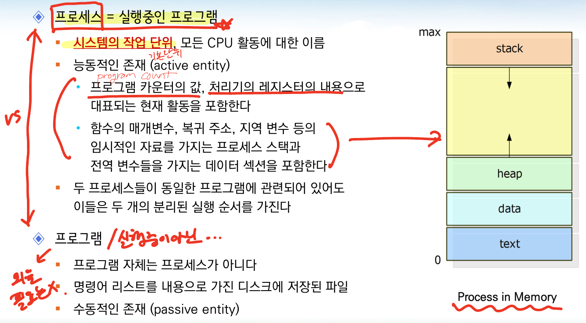

# 3주차 - 프로세스
 
 

# 프로세스 개념

### 모든 CPU 활동을 어떻게 부를 것인가?

- 초창기 컴퓨터 : 작업을 실행하는 일괄처리 시스템

- 단일 사용자 시스템에서도 사용자는 여러 프로그램들을 동시에 실행할 수 있음

→ 이런 모든 활동을 프로세스 라고 부름
 
 

## 프로세스 = 실행중인 프로그램

- **시스템의 작업 단위**

- 능동적인 존재

- 프로그램 카운터의 값, 처리기의 레지스터 내용으로 대표되는 현재 활동을 포함
- 함수의 매개변수, 복귀 주소, 지역 변수 등의 임시적인 자료를 가지는 프로세스 스택
- 전역 변수들을 가지는 데이터 섹션을 포함

- 두 프로세스들이 동일한 프로그램에 관련되어 있어도 이들은 두 개의 분리된 실행 순서를 가짐
 

 

 
 

## **프로세스 상태**

 

## 프로세스 제어 블록

 
 

# 프로세스 스케줄링 = CPU 스케줄러

- 프로세스 스케줄러(process scheduler)

- 실행 가능한 여러 프로세스들 중에서 하나의 프로세스를 선택 (ready 상태 중 1개 선택)
 
 

## 스케줄링 큐와 스케줄링

 
 

## **문맥 교환**

- 문맥 교환(context switch) / CPU는 한번에 한개씩 일을 처리 (CPU 입장에서는 일이 계속 바뀜)

- **CPU 코어를 다른 프로세스로 교환하려면 이전 프로세스 상태를 보관하고 
새로운 프로세스의 보관 상태를 복구하는 작업**
- 문맥 교환 시간
    - 하드웨어 지원에 의해 크게 좌우됨
        - 메모리의 속도, 레지스터의 수, 특수 명령어의 존재에 좌우
    - 운영 체제가 복잡할수록 문맥 교환에 더 많은 작업이 요구
- 문맥 교환 시간은 순수한 오버헤드 / 순수하게 CPU 효율로 봤을때 하지 않아도 되는 일을 하는 것
    - 문맥 교환이 진행될 동안 시스템은 아무런 유용한 일을 하지 못함

 
 

# 프로세스에 대한 연산

## 프로세스 생성

- 프로세스는 **실행되는 동안 여러 개의 새로운 프로세스들을 생성**할 수 있음

- 부모 프로세스 : 생성하는 프로세스
- 자식 프로세스 : 생성된 프로세스
- 새로운 프로세스들은 다른 프로세스들을 생성할 수 있으며, 그 결과 프로세스들의 트리를 형성
- 프로세스 식별자(pid)를 사용하요 프로세스를 구분

- 태초의 프로세스는 커널이 임의로 만듬

- 프로세스가 자식 프로세스를 생성할 때, **자식 프로세스는 자신의 임무 달성을 위해 자원이 필요**

- 자식 프로세스는 자원을 운영체제로부터 직접 얻거나,
- 부모 프로세스가 가진 자원의 부분 집합 만을 사용하도록 제한될 수 있음
    - 부모 프로세스는 자원을 분할하여 자식 프로세스에게 일부 자원을 같이 사용하게 할 수 있음

- 프로세스가 새로운 프로세스를 생성할 때, **두 프로세스를 실행하는 두 가지 가능한 방법**

- 부모 프로세스는 자식 프로세스와 병행하게 실행을 계속
- 부모 프로세스는 모든 자식 또는 일부 자식 프로세스가 종료할 때까지 기다림

- 프로세스들의 **주소 공간** 측면에서 두 가지 가능성

- **자식 프로세스는 부모 프로세스의 복사본**
    - 자식 프로세스는 부모와 똑같은 프로그램과 데이터를 가짐
- **자식 프로세스가 자신에게 적재될 새로운 프로그램을 가짐 / exec**

 
 

## 프로세스 종료

- 프로세스는 **마지막 문장의 실행을 끝내고, exit() 시스템 콜을 사용하여 운영 체제에 자신의 삭제 요청** → 종료

- 프로세스는 자신의 부모 프로세스에게 상태 값을 반환할 수 있음(wait)
- 프로세스가 종료하면 자원은 OS로 반납

- 프로세스는 적당한 시스템 콜을 통해서 다른 프로세스의 종료를 유발할 수 있음 / kill

- 종료될 프로세스의 부모만이 호출할 수 있음
- 부모 프로세스는 여러 가지 이유로 자식 중 하나의 실행을 종료할 수 있음
    - 자식 프로세스가 할당된 자원을 초과하여 사용할 때
    - 자식에게 할당된 태스크가 더 이상 필요 없을 때
    - OS가 부모가 종료되면 자식이 계속 수행한흔 것을 허용하지 않는 경우
        
        → 연쇄식 종료 (케스케이드 종료)
        

- 부모 프로세스는 wait()를 사용해서 자식 프로세스가 종료할 때까지 기다릴 수 있음

- **Zombie 프로세스 : 종료되었지만 부모 프로세스가 아직 wait() 호출을 하지 않은 프로세스**
- **Orphan 프로세스 : 부모 프로세스가 wiat()를 호출하는 대신 종료하는 경우**

 
 

 
 

# 프로세스 간 통신 / IPC (Interprocess Communication)

### 운영체제 내에서 수행되는 병행 프로세스들은 독립적이거나 협력적인 프로세스들일 수 있음

- 독립적인 프로세스들
    - 시스템에서 실행중인 다른 프로세스들에게 영향을 주거나 받지 않는 프로세스
    - 다른 프로세스와 데이터를 공유하지 않는 프로세스
- 협력적인 프로세스들
    - 시스템에서 실행중인 다른 프로세스들에게 영향을 주거나 받는 프로세스
    - 다른 프로세스들과 자료를 공유하는 프로세스
    

### 프로세스 협력을 허용하는 환경을 제공하는 이유

- 정보 공유 information sharing
    - 여러 응용 프로그램이 동일한 정보에 흥미를 가질 수 있고, 이 정보를 병행적 접근할 수 있는 환경 제공
- 계산 가속화 computation speedup
    - 태스크를 빨리 실행하고자 한다면 이를 서브태스크로 나누어 각 서브태스크들과 병렬로 실행
- 모듈성 modularity
    - 시스템의 기능을 별도의 프로세스들 또는 스레드들로 나누어 모듈 형태로 시스템 구성

### 협력적 프로세스들은 자료와 정보를 교환할 수 있는 기법을 필요로 함

→ IPC 기법

- 메시지 전달
- 공유 메모리

 
 

## 공유 메모리 시스템

### 통신하는 프로세스들이 공유 메모리 영역을 구축

- **생산자-소비자 프로세스** 예

 
 

- 생산자 프로세스는 정보를 생산하고 소비자 프로세스는 정보를 소비

  : 병행하여 실행되도록 하려면 → 생산자가 정보를 채워 넣고, 소비자가 비울 수 있는 버퍼들의 저장소 제공

 
 

 
 

## 메시지 전달 시스템

- 운영체제가 메시지 전달 설비를 통하여 서로 협력하는 프로세스 간 통신 수단을 제공

- 동일한 주소 공간을 공유하지 않고, 프로세스들이 통신을 하고 그들의 동작을 동기화 할 수 있도록 
허용하는 기법을 제공
- 최소한 두 가지 연산을 제공
    - send (message)
    - receive (message)
- 통신을 하려면 반드시 서로 메시지를 보내고 받아야 하고, 이들 사이에 통신 연결이 설정되어 있어야 함

→ 하나의 링크와 send / receive 연산을 논리적으로 구현하는 방법들

- 직접 또는 간접 통신
- 동기식 또는 비동기식 통신
- 자동 또는 명시적 버퍼링
 
 

## 메시지 전달 시스템 - 명명

- 직접 통신 : 통신을 원하는 각 프로세스는 통신의 수신자 또는 송신자의 이름을 명시
    - `send (P , message)` / `receive (Q, message)`
    - 직접 통신 연결의 특성
        - 통신을 원하는 각 프로세스의 쌍들 사이에 연결이 자동으로 구축
        - 연결은 두 프로세스 사이에만 명시적으로 지정
        - 통신하는 프로세스 쌍 사이에는 정확히 하나의 연결이 존재
- 간접 통신 : 메시지들은 메일박스**(커널이 관리)**로 송신되고 그것으로부터 수신
    - `send (A, message)` / `receive (A, message)`
    - 간접 통신 연결의 특성
        - 한 쌍의 프로세스들 사이의 연결은 공유 메일박스를 가질 때만 구축
        - 연결이 두 개 이상의 프로세스와 연관될 수 있음
        - 프로세스들 사이에 다수의 서로 다른 연결이 존재할 수 있고, 각 연결은 하나의 메일 박스에 대응
 
 

## 메시지 전달 시스템 - 동기화

- **메시지 전달은 봉쇄형(blocking, 동기식)이거나, 비봉쇄형(nonblocking, 비동기식)**
    - 봉쇄형 송신 (blocking send) → 보내놓고 대기
        - 송신하는 프로세스는 메시지가 수신 프로세스 또는 메일박스에 의해 수신될 때까지 봉쇄
    - 비봉쇄형 송신 (nonblocking send) →보내놓고 대기 X
        - 송신하는 프로세스가 메시지를 보내고 작업을 재시작
    - 봉쇄형 수신 (blocking receive) → `scanf`
        - 수신하는 메시지가 도착할 때까지 봉쇄
    - 비봉쇄형 수신 (nonblocking receive) → 메시지 O/X에 따라 각각 처리 필요
        - 수신자는 유효한 메시지를 받거나 널을 받음
 
 

## 메시지 전달 시스템 - 버퍼링

- **메시지 큐** : 통신하는 프로세스들에 의해 교환되는 메시지는 임시 큐에 존재
    - 무용량 (zero capacitiy) : 큐의 최대 길이가 0인 경우
        - 송신자는 수신자가 메시지를 수신할 때까지 기다려야 함
    - 유한 용량 (bounded capacity) : 큐의 길이가 n > 0인 경우
        - 송신자는 큐가 만원(full)이 아니면 메시지를 큐에 넣고 계속 수행하고, 그렇지 않으면 대기
    - 무한 용량 (unbounded capacity) : 큐의 길이가 무한
        - 송신자는 결코 기다림 없이 메시지를 큐에 넣고 계속 수행
            
            → 큐는 절대로 넘치지 않는다는 가정 하에 진행됨 : **거의 불가능**
            
    - 유용량 (nonzero capacity) : 송신자의 입장에서 메시지의 도달이 확인되지 않음
        - 수신을 확인하기 위해서는 명시적인 통신이 필요

→ **유한 용량을 채택해서 사용**