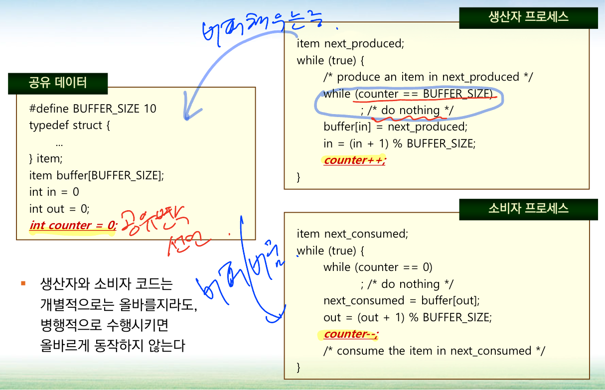

# 6주차 - 동기화 도구들

 

# 동기화 문제들 (배경)

## 유한 버퍼 문제

 

- 생산자 프로세스와 소비자 프로세스가 공유하는 변수를 선언 `counter`

- **생산자 프로세스**는 버퍼를 채우는 중이며, **소비자 프로세스**는 버퍼를 비우는 과정

- 생산자 프로세스의 while 문 : counter가 버퍼 사이즈와 같다면 (공간이 가득 참) → `/* do nothing */`

- 소비자 프로세스도 같은 상황

- 아래와 같은 흐름으로 진행

 

- CPU 안에 레지스터(1)이 있음 (r1)

- counter 변수는 메모리에 있음 (초기값 0)

- CPU가 counter 변수를 증가시키려면, 메모리에서 가져오고, counter를 1 증가시키는 동작이 필요

 

### CPU 1개로 가정

- 생산자, 소비자 반복하여 수행 / Round Robbin 수행한다 가정

- register1 → 생산자의 값 register2 → 생산자의 값을 유지했다 가정

 

- 메모리의 counter 값 : 5

- 생산자 시작 → memory의 counter 값을 register1로 가져온 뒤 값을 증가 → register1 = 6

- **스케줄러가 스케줄링을하여 소비자가 시작됨**

- 소비자 시작 → memory의 counter 값을 register2로 가져온 뒤 값을 감소 → register2 = 4

- 그 사이 또 다시 스케줄링이 발생 → 생산자 시작 (이어서)

- 메모리에 register1에서 가져온 값을 저장 → counter = 6

- 소비자가 이어서 수행 → 메모리에 register2에서 가져온 값을 저장**(덮어씌움)** ⇒ counter = 4

### 경쟁 상황(race condition) 발생!!!!

- 동시에 여러 개의 프로세스가 동일한 자료를 접근하여 조작하고, 그 실행 결과가 접근이 발생한 특별한 순서에 
의존하는 상황

: ***프로세스들이 동기화되도록 할 필요가 있음***

### 동기화 : synchronized / 코드의 실행 영역에 제어를 거는 행위

### race condition을 일으키는 부분 → critical section : 임계 구역

 
 

# 임계 구역

 

- entry section : 진입 허가 시점 → counter 변수가 현재 사용 중인가?

- critical section : 임계 구역 → 경쟁 상황을 발생시키는 구역

- exit section : 탈출 시점 → counter 변수 사용이 끝났음을 알려주어야됨

### 임계구역

- 각 프로세스는 임계구역이라는 코드 부분을 포함하고 있고, 그 안에서는 다른 프로세스와 공유하는 변수를 변경하는 내용을 포함 / 예 : `counter`

- 임계구역은 **상호 베타적** 이어야함

: 생산자 프로세스가 counter 변수를 사용하고 있는 시점 `counter++` 이라면, 
소비자 프로세스는 counter 변수를 사용하는 `counter--`를 **절대 사용할 수 없음**

## 임계구역 문제 해결안

- 다음 세 가지 요구 조건을 충족

- 상호 배제
    - 한 프로세스가 임계구역에서 실행된다면 그 임계구역을 공유하는 다른 프로세스들은 임계구역에서 
    실행될 수 없음
- 진행
    - 자기의 임계구역에서 실행되는 프로세스가 없는 상태 (**나머지 구역 처리 중**)
    - 새로운 프로세스가 임계구역으로 진입하려 한다면, 나머지 구역에서 실행하고 있지 않는 프로세스들만 
    진입을 결정하는데 참여할 수 있음
    
    → 임계구역에 관심이 있는 프로세스끼리 경쟁해서 임계구역에 들어 가야함
    
- 한계 대기
    - 특정 프로세스는 원할 때 못 들어가고 많이 기다려야하는 경우이 존재할 수 있음
    - 해당 것을 고려해서 설계가 되어야 함

# 피터슨의 해결안

## 왜 등장하였는가?

### 차례를 매겨보는 과정..

 

- turn 변수가 처음에는 0이라는 값을 가지고 있고, 프로세스가 두 개만 있다고 가정

- turn 변수와 일치하는 프로세스가 실행을 한다고 생각

- 프로세스가 수행 후 turn을 1/0으로 변경

→ 생산자가 지속적인 수행이 불가능 (turn이 1이 되어서 불가능) : 동작을 원할히하는데 문제

### 현대의 컴퓨터 구조에서 올바르게 동작하는 것을 보장하지 않음

# 동기화를 위한 하드웨어 지원

### 임계구역 문제는 단일 처리기 환경에서 공유 변수가 변경되는 동안 
인터럽트 발생을 허용하지 않음으로써 간단히 해결할 수 있음

→ **효율이 굉장히 나쁨 / CPU가 여러개인 경우 큰 의미가 없음**

## 하드웨어 명령어

→ 한 프로세스만 사용할 수 있음 (동시에 수행 불가)

### test_and_set

 

- test_and_set 값이 true인 경우 while문 안을 돌게됨

### compare_and_swap

 

### 위 두 개의 하드웨어 코드는 어셈블리어로 표현되었을 것으로 예상 가능 → 사용하기 불편

### 원자적 변수(atomic variable)

- HW적으로 그 문장을 수행 시, 다른데서 수행하지 못하게 설정하는 것 → 원자적 연산을 제공

# 뮤텍스 락

 

→ **상호 배제적**의 앞글자를 가져온 뮤텍스

- mutex 락은 boolean 변수 available을 가지며, 이 변수 값이 락의 가용 여부를 표시

- `aquire()` / `release()` 함수 정의

- available이 false일때 while문 안에서 실행

- avaiable true인 경우, available = false로 바꿈

- OS가 제공하는 것이므로, 새로운 프로세스를 스케줄링 하지 않게 할 수 있음

→ `acquire()`와 `relase()`를 atomic하게 동작할 수 있음

### 바쁜 대기(busy wait)에 의한 구현 : spinlock

→ **계속 무의미한 대기를 함** / available이 true인가?를 지속적으로 체크 진행

### CPU가 1개인 경우

 

- 스케줄러에 의해 소비자가 먼저 실행 → `acquire()`를 통과

- `counter--` 이 오래 걸린다 가정했을 때, available = false 상태 유지

- 스케줄러가 소비자가 할당된 시간(10초)을 다 사용하게 되어, 생산자가 스케줄러에 의해 시작 하게됨

-  `aquire()` 수행 시작 → available이 false이므로, 생산자는 10초 간 busy wait 상태에 돌입하게 됨

→ 절대로 일어나지 않을 사건을 기대하면서 busy wait을 하게됨

### CPU가 2개인 경우

 

- 소비자가 먼저 `acquire()` 실행 → available = false / CPU 2번에서 실행 중

- 이어서 생산자가 실행 후 `acquire()` 실행

- 생산자는 busy wait은 하게 되지만, 병렬적으로 진행하므로 가능한 사건을 대기를 하게됨

→ false가 true가 되는 순간에 실행을 하게됨

### 정리하자면…

- mutex락이 가용해지기를 기다리면서 프로세스가 계속 기다림

- CPU가 1개인 일반적인 환경과 두개인 경우에도 busy wait을 하게되어 시간을 낭비함

- **코어가 많은 특정한 상황에서는 스핀락이 선호됨**

 

# 세마포

- mutex보다 먼저 나옴 → 폭넓게 기능 제공 : 무겁고 복잡함

- 좀더 다양한 값을 가질 수 있는 정수 변수

### semaphore = 정수 변수

- `wait()`과 `signal()`이라는 시스템 호출을 통해서만 고칠 수 있는 특별한 변수 semaphore

 

- 뮤텍스와 동작 방식은 동일

- OS가 스케줄러를 관리하므로, 실행 중간에 끼어들 일은 없음

- 정수 변수이므로, 다양하게 초기화 가능
 

## 세마포 사용법

### 카운팅 세마포

- 초기값을 유한한 개수를 가진 자원에 대한 접근을 제어하는 데 사용될 수 있음 : S = 5 → 5개 제한

### 이진 세마포

- 이진 세마포의 값은 0과 1사이의 값만 가능

 

- synch 초기값 0 가정

- P2 수행 시, wait을 만남 → synch가 0이므로 대기

- P1 수행 시 , signal(synch)를 만나면 1로 초기화 → P2 수행 가능

- 초기값을 조절해 서로 다른 프로세스의 수행 순서를 결정 가능

- 프로세스 1,2,3의 동작이 끝나야 S3를 실행 가능하게 한다면 초기값을 -1로 지정 하고 1이되면 S3 진행

 

## 세마포 구현

- **단일 cpu 일 때, busy wait 문제점 발생**

- cpu를 더 이상 사용할 필요가 없으니 wait 상태로 바꾸는 것 → **waiting queue를 가지게 됨**

- sleep 상태로 뺴버려서 다른 프로세스들이 일을 할 수 있고 원래 CPU는 의미있는 일을 하게 함

 

1. 세마포는 1 로 시작하며, 큐가 존재
    
    → 세 개의 프로세스들에 대하여,
    
2. P1이 수행 시작 ~ `value--` 진행 ~ 세마포 : 0
3. wait을 통과하고 P1이 수행 중~
4. P2 수행 시작 → S = -1이됨
5. wait에 걸림 ~ 큐에 등록이됨 `sleep()` 상태 진입 → 강제로 wait 상태로 전환되는 상황
6. P3도 역시 위와 같은 방식으로 세마포 : -2 되어서, 큐에 등록된 뒤 wait
7. P1이 열심히 일을 진행 ~ `value++` 진행
8. P1이 끝나고 세마포가 -1 이므로. `wakeup()` 진행 → P2를 꺼내는 과정
    
    : signal 안의 if문은 큐에 무언가 있는가를 체크하는 부분
    

**세마포 구현에서는 spinlock을 사용하지 않도록 구현할 수 있다는 것이 포인트!**

→ 설사 CPU가 여러 개라 하더라도, CPU 하나를 사용해서 수행하던 생성자가, 
쓸데없이 busy wait하지 않아 CPU를 낭비를 막음
 

### 단점 ?

- wakeup을 하게된 프로세스가 readyqueue에 들어갈 때, 제일 먼저 실행 된다는 보장이 없음

→ 준비 큐에 어떠한 프로세스가 있을지 모름

→ wakeup된 큐는 ready 큐 맨 뒤에서 대기 후 CPU에 선택을 받아 실행하게 됨

물론 우선순위가 높다면 먼저 실행되지만, 보장이 되지 않음
 
 

### 멀티코어 시스템에서 스핀락이 선호되기도 함

- 경쟁 상황을 발생시키는 임계구역, critical section에서 요구되는 시간이 짧은 경우, 스핀락이 선호되기도 한다.

- 락을 사용하게될 수 있는 시점에 바로 시작할 수 있는 것을 보장 가능 → 우선순위가 높아지는 것과 같은 효과

- 목적과 상황에 따라 다를 수 있음

- **그러나, 코어가 1개인 경우에는 스핀락은 무조건 안좋고, 코어가 여러개여도 시스템의 전체적인 성능으로 보면 좋지 않으나, 그걸 수행하는 프로세스 입장에서는 특별한 경우에는 스핀락 형태도 선호할 수 있음**

# 모니터

- 세마포는 자칫 잘못 사용하면 발견하기 어려운 타이밍 오류를 야기할 수 있음

- 원하는 동기화를 적용하지 못하는 경우 혹은 무한 로딩에 빠지는 경우가 있을 수 있음

 

- 모니터라는 컨셉이 등장하게됨

- 모니터라는 개념은 캡슐화, 즉 상호 배제가 보장되는 자료구조를 사용하는 것

- 공유 데이터를 직접적으로 사용하지 못하고 공유 데이터를 다루는 함수를 사용해서만 접근

- **공유 데이터를 다루는 함수는 동기화가 해결되게 설계되도록 보장**

→ 프로그래머가 직접 동기화 조건을 직접 넣어서 코딩할 필요가 없음

- Java에서는 synchronized를 제공

 

 
 
 

# 라이브니스

## 교착 상태

 

- 서로 다른 두 프로세스가 두 이진 세마포가 필요한 상황으로 가정

- P0가 실행되면 세마포가 wait 시 0으로 ~ signal시 1으로 초기화 

- P0 wait(S) 실행 후 critical section에 들어가 있는 상황에서 P1의 wait(Q)가 실행

- P1의 wait(S)에서 이미 0이 차지하고 있는 상황으로 수행 불가능

- 다시 P0로 돌아와서 실행하려고 보니, 이미 Q에 0이 차지하고 있으므로 수행 불가능 / 아래의 **교착상태 발생**

 

→ 교차로에서 얽혀서 빠져나가지 못하는 상황과 같은 경우…
 

## 우선순위 역전

- 높은 우선순위 프로세스가 현재 낮은 우선순이 프로세스 또는 연속된 낮은 우선순위 프로세스들에 의해 스케줄에 문제가 발생

ex) L < M < H 의 우선순위인 3개의 프로세스 L, M, H

- L이 먼저 공통의 데이터 R을 실행

- M이 들어와서 우선순위로 인해 L 대신 먼저 선점 후 실행

- 이때, H가 들어와 M이 우선순위에 밀리며, H가 실행

- H는 L이 사용중인 공통의 데이터 R을 필요하는 상황인데 L이 사용중인 상태로 H 실행 불가

- L은 우선순위가 낮으므로 지속적으로 실행 불가

→ 낮은 우선순위를 가진 프로세스가 공통의 자원을 사용하므로 인해 
우선순위가 젤 높은 H가 우선순위가 젤 낮은 우선순위 처럼 사용할 수 없는 상황 발생

: **우선순위 역전**

- **우선순위 상속 프로토콜로 해결**

: critical section을 수행하는 동안 우선순위를 높였다가, 실행이 완료되면 우선순위를 원래대로 돌려놓는 것

**와치독 시스템으로 재부팅도 하기도함**