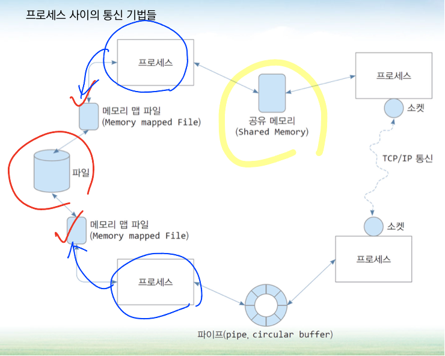

# 4주차 - 스레드와 병행성
 
 

# 개요

- 스레드가 없을 때 기존 방법

 
 

### Thread = CPU 이용의 기본 단위

- 구성 : 스레드 ID, 프로그램 카운터, 레지스터 집합, 스택
- 같은  프로세스에 속한 다른 스레드와 코드, 데이터 섹션, 열린 파일이나 신호 등의 운영체제 자원 공유
    - 싱글 스레드 프로세스와 멀티 스레드 프로세스 도식화
    

 
 

    

## 동기

- 현대 컴퓨터에서 동작하는 거의 모든 소프트웨어 응용들은 **다중 스레드를** 이용

- **하나의 응용은 몇 개의 실행 흐름을 가진 독립적인 프로세스로 구현**

- Ex)

- 이미지 모음에서 사진 축소판을 만드는 응용 프로그램
    - 별도의 스레드를 사용하여 개별 이미지에서 축소판 생성
- 웹 브라우저 (Web browser)
    - 이미지 또는 텍스트를 표시하는 하나의 스레드
    - 네트워크로부터 데이터를 가져오는 또 다른 스레드
- 워드프로세서 (Wordprocessor)
    - 그래픽을 표시하는 스레드
    - 사용자의 키 입력에 응답하는 스레드
    - 백그라운드에서 맞춤법과 문법 검사를 수헹하는 스레드

 
 

- **하나의 응용이 여러 개의 비슷한 작업들을 실행할 필요가 있는 상황 존재**

- 웹 서버(Web server)

 
 

- 대부분의 **운영체제 커널은 현재 다중화** 되어 있음

- 커널 안에서 다수의 스레드가 동작하고, 각 스레드는 장치 또는 인터럽트 처리 등의 작업 실행
- Linux 시스템
    - 시스템을 부트하는 동안 여러 커널 스레드가 생성
    - 각 스레드는 장치 관리, 메모리 관리, 인터럽트 처리와 같은 특정 작업 수행

- **많은 응용 프로그램도 기본 정렬, 트리 및 그래프 알고리즘을 포함하여 다중 스레드를 활용할 수 있음**

# 다중 코어 프로그래밍

- 다중 스레드 프로그래밍은 다중코어를 더 효율적으로 사용할 수 있고 병행성을 더 향상시킬 수 있는 기법을 제공

- 스레드가 4개인 응용 프로그램 예시

- 단일 코어 시스템에서의 병행 실행 (concurrent execution)
    - 하나의 코어는 한 번에 하나의 스레드만 실행할 수 있기 때문에 병행성은 단순히 스레드의 실행이
    시간에 따라 교대로 실행된다는 것을 의미
    

 
 

    
- 다중 코어 시스템에서의 병행 실행 (parallel execution)
    - 여러 코어를 가진 시스템에서 병행성은 개별 스레드를 각 코어에 배정할 수 있기 때문에 병행성은
    일부 스레드들이 병렬적으로 실행될 수 있음
    

 
 

    

# 다중 스레드 모델

- 스레드를 위한 지원은… 
   사용자 스레드를 위해서는 사용자 수준에서, 커널 스레드를 위해서는 커널 수준에서 제공

- 사용자 스레드 (user thread)
    - 커널 위에서 지원되며 커널의 지원 없이 관리
- 커널 스레드 (kernel thread) → **커널에서 관리하는 스레드**
    - 운영체제에 의해서 직접 지원되고 관리

- 궁극적으로는 사용자 스레드와 커널 스레드는 어떤 연관 관계가 존재

## 다대일 모델

- 많은 사용자 수준 스레드를 하나의 커널 스레드로 사상

- 스레드 관리는 사용자 공간의 **스레드 라이브러리**에 의해 행해짐
- 한번에 하나의 스레드 만이 커널에 접근할 수 있음
    
    → 하나의 스레드가 봉쇄형 시스템 콜(응답 대기)을 할 경우, **전체 프로세스가 봉쇄되며
    다중 스레드가 다중 코어 시스템에서 병렬로 실행될 수 없음**
    

 
 

## 일대일 모델

- 각 사용자 스레드를 각각 하나의 커널 스레드로 사상 → OS도 스레드를 알아야함

- 다대일 모델보다 많은 병렬성을 제공
- 다중 처리기에서 다중 스레드가 병렬로 수행되는 것을 허용
- 사용자 수준 스레드를 생성할 때, 그에 따른 커널 스레드를 생성해야함
    - **많은 수의 커널 스레드가 시스템 성능에 부담을 줄 수 있음**

 
 

## 다대다 모델

- 여러 개의 사용자 수준 스레드를 그보다 작은 수 혹은 같은 수의 커널 스레드로 멀티프렉스 진행

- 커널 스레드의 수는 응용프로그램이나 특정 기계에 따라 결정
- 개발자는 필요한 만큼의 사용자 수준 스레드를 생성할 수 있음
- 상응하는 커널 스레드가 다중 처리기에서 병렬로 실행될 수 있음

 
 

## 두 수준 모델 / 다대다 모델의 변형

- 많은 사용자 스레드를 적거나 같은 수의 커널 스레드로 다중화시키는 것을 유지

- 하나의 사용자 스레드가 하나의 커널 스레드에 종속되도록 허용

 
 

# 스레드 라이브러리

## Pthreads

 
 

# 암묵적 스레딩

## 스레드 풀

- Two issues in multithreaded server

- 서비스할 때마다 스레드를 생성하는 시간은? / 동시에 실행할 수 있는 최대 스레드 수는?

→ 스레드 풀 (thread pools)

- 프로세스가 시작될 떄 미리 일정한 수의 스레드들을 미리 만들어두고 (초기 개수가 지정되어 있음),
서버가 요청을 받으면 pool에 있는 하나의 스레드를 할당

ex) 웹 서버 → 서버에 접속할 때 (동시에) 미리 생성된 스레드를 할당

- 스레드 풀의 장점

- 새 스레드를 만들어 주기 보다 기존 스레드로 서비스해주는 것이 더 빠름
- 스레드 풀은 임의 시각에 존재할 스레드 개수에 제한을 둠
    - 많은 수의 스레드를 병렬 처리할 수 없는 시스템에 도움을 줌
- 태스크와 무관하게 태스크를 생성할 수 있으면 태스크를 실행할 때 다양한 전략 사용 가능